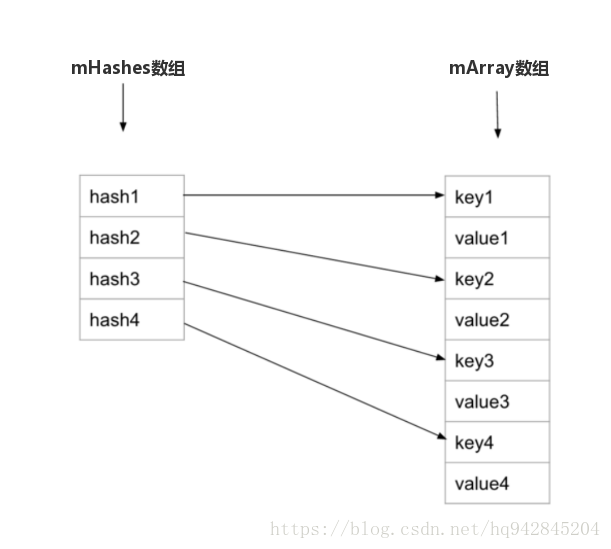

## SparseArray

key值为int的HashMap。  

key和value都是使用数组存储，共享index。
key值按升序排列。  
插入操作使用二分法查找index。

## ArrayMap
使用上和HashMap一样，不同的是结构上使用数组+数组。

- mHashes[]：存放key值计算出的hash，升序排列。
- mArray[]：存放key和value，key就是 index\*2 ，value 就是index\*2+1  

put操作也是使用二分法查找下标：先计算key的hash值，在用二分查找mHashs数组，得到对应的下标。

使用场景：

- (1) 首先二者都是适用于数据量小的情况，但是SparseArray以及他的三兄弟们避免了自动装箱和拆箱问题，也就是说在特定场景下，比如你存储的value值全部是int类型，并且key也是int类型，那么就采用SparseArray，其它情况就采用ArrayMap。
- (2) 数据量多的时候当然还是使用HashMap啦

都是以时间换空间。
