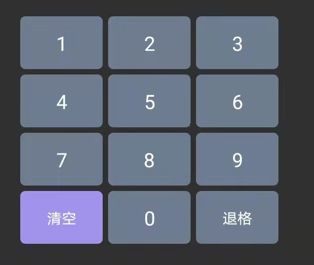
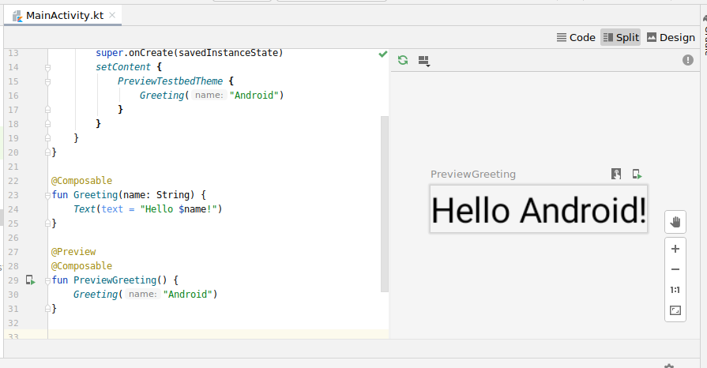

# Compose
Compose是一个适用于Android的声明式UI工具库。

## 何为声明式UI？
简单来说其工作原理就是状态更新时，从头开始重新生成整个屏幕界面，然后仅执行必要的更改。此方法可避免手动更新有状态视图层次结构的复杂性。  

重新生成整个屏幕同时也带来一些问题：计算能力、电池用量等成本高昂。  

Compose为减轻这些性能消耗，会智能的选择重绘界面哪些部分，当然也不完全智能，还是得依靠规范的编码和组件设计。

## 举个栗子

```java

@Compose
fun HelloWorld(name:String){
  Text("Hello $name")
}

```

 - 所有可组合函数都必须带有@Compose，告知编译器这是个界面组件
 - Text()也是个可组合函数，可组合函数通过调用其他可组合函数来构建界面层次结构。
 - 可组合函数不需要返回任何内容，它们只是用来声明界面的状态。
 - 此函数**快速**、**幂等**，且没有**副作用**。

幂等：指可以使用相同参数重复执行，并能获得相同结果的函数，不会因为某些状态的变化而结果发生变化。

无副作用：该函数应该是个纯函数，不应修改程序的状态或修改全局变量。

至于为什么有幂等、无副作用等要求，待看下文讲解。

## 状态控制

可组合函数是相对无状态的，那么我们怎么去控制界面状态的刷新了？  
这就得使用ViewModel+State去进行界面状态的控制。可组合函数在每次可观察数据更新时会触发重组更新界面。


应用逻辑为顶级可组合函数提供数据。该函数通过调用其他可组合函数来使用这些数据描述界面，将适当的数据传递给这些可组合函数，并沿层次结构向下传递数据。

当用户与界面交互时，界面会发起 onClick 等事件。事件通过回调传递到ViewModel，ViewModel中执行业务逻辑可以改变应用的状态。当状态发生变化时，系统会使用新数据再次调用可组合函数。这会导致重新绘制界面元素，这个过程就叫“重组”。  


## 重组

**系统发生重组时会智能的选择需要新数据的可组合函数，然后调用它。**

### （1）、可组合函数会按任何顺序执行

```java
@Composable
fun ButtonRow() {
    MyFancyNavigation {
        StartScreen()
        MiddleScreen()
        EndScreen()
    }
}
```

### （2）、可组合函数可以并行运行，可能会同时从多个线程调用函数

Compose为优化重组带来的性能消耗，会在后台线程池中去调用可组合函数。  

如果某个可组合函数调用 ViewModel 的一个函数，则 Compose 可能会同时从多个线程调用该函数，所以说可组合函数不应该有副作用。

```java

@Composable
@Deprecated("Example with bug")
fun ListWithBug(myList: List<String>) {
//传入的参数应用MutableState包裹

    var items = 0

    //横向布局
    Row(horizontalArrangement = Arrangement.SpaceBetween) {
        //纵向布局
        Column {
            for (item in myList) {
                Text("Item: $item")
                items++ // Avoid! Side-effect of the column recomposing.
            }
        }
        Text("Count: $items")
    }
}

```

### （3）、重组会跳过尽可能多的内容

如果界面的某些部分无效，Compose 会尽力只重组需要更新的部分。这意味着，它可以跳过某些内容以重新运行单个按钮的可组合项，而不执行界面树中在其上面或下面的任何可组合项。

```java

@Composable
fun NamePicker(
    header: String,
    names: List<String>,
    onNameClicked: (String) -> Unit
) {
    Column {

        Text(header, style = MaterialTheme.typography.h5)
        Divider()

        LazyColumn {
            items(names) { name ->

                NamePickerItem(name, onNameClicked)
            }
        }
    }
}


@Composable
private fun NamePickerItem(name: String, onClicked: (String) -> Unit) {
    Text(name, Modifier.clickable(onClick = { onClicked(name) }))
}

```

当 header 发生更改时，Compose 可能会跳至Column lambda，而不执行它的任何父项。  
此外，执行Column时，如果names未更改，Compose可能会选择跳过 LazyColumnItems。


### （4）、重组是乐观操作

只要 Compose 认为某个可组合项的参数可能已更改，就会开始重组。如果某个参数在重组完成之前发生更改，Compose 可能会取消重组，并使用新参数重新开始。


### （5）、可组合函数可能会非常频繁的运行

 在某些情况下，可能会针对界面动画的每一帧运行一个可组合函数。如果该函数执行成本高昂的操作（例如从设备存储空间读取数据），可能会导致界面卡顿。


## 状态管理

### LiveData and State

如果你想通过数据变化自动刷新UI显示，LiveData和State都只能在它所包裹的对象发生变化时刷新UI。
所以当我们包裹的是一个对象，只是更改了对象中某个属性的值时，这并不会触发重组，刷新UI。

对于这种情况可以针对对象的某个属性使用`MutableState<T>`包裹，例如：


``` java

data class People(var name: MutableState<String>, var sex:String){

}

```

另外对于list类型，也有`mutableStateListOf`可以用。


### 结合MVVM

 对于服务端返回的展示数据类，推荐自定义一个用于展示的数据类，这样做有几点好处：

  - 方便UI状态控制，使用 MutableState<T>包裹数据
  - 对数据进行预处理，让后续业务流程可以直接使用该数据
  - 方便维护，如果接口返回数据类型有变化，不会影响到业务模块


 ```java

 class GoodsInfoResp(
     //根据typeGuid已经分好类
     val typeList: List<GoodsDTO>?
 ) {

     fun toDisplayData() = this.typeList?.map {
         it.toDisplayData()
     }
 }


 data class GoodsDTO(
     val name: String,
     val price:Double,
     val sort: Int,
     val typeGuid: String,
     val itemList: List<ItemDTO> = mutableListOf(),
 ) {

     fun toDisplayData() = DisplayTypeData(
         name = mutableStateOf(this.name),
         price = mutableStateOf(this.price),
         ...
         padItemRespDTOList = this.itemList.map {
             it.toDisplayData(this.menuClassifyPictureType)
         }
     )

 }

 data class GoodsDTODisplay(
     val name: MutableState<String>,
     val price:MutableState<Double>,
     val sort: Int,
     val typeGuid: String,
     val itemList: List<ItemDTO> = mutableListOf(),
 ) {

 }

 suspend fun requestGoodsList(): Flow<List<DisplayTypeData>?> {
      return source.getGoodsList()
          .map { it.toDisplayData() }
          .map {...}
  }

 ```


## 组合 VS 继承

在面向对象编程中，我们一般使用继承去扩展一个View，自定义View来写一些控件，很繁琐，特别是里面还夹着逻辑时很难维护；而在Compose中你只需要组合调用Composable函数便可以得到不同的控件了。




```java


/**
 * @param onValueChange 数字输入回调
 * @param onClearClick 清空回调
 * @param onBackSpaceClick 退格回调
 */
@Composable
fun NumberKeyboard(
    modifier: Modifier = Modifier,
    onValueChange: (Int) -> Unit,
    onClearClick: () -> Unit,
    onBackSpaceClick: () -> Unit,
    isUserIcon: Boolean = false
) {

    val numberList = listOf(1, 2, 3, 4, 5, 6, 7, 8, 9, 10, 11, 12)

    GridLayout(
        modifier = modifier
            .width(350.wdp)
            .height(290.hdp),
        contentPadding = PaddingValues(7.wdp),
        list = numberList,
        columns = 3,
        withIndex = { data, index ->
            NumberItem(number = data, isUserIcon = isUserIcon) {
                when (data) {
                    1, 2, 3, 4, 5, 6, 7, 8, 9 -> {
                        onValueChange(data)
                    }
                    10 -> {
                        onClearClick()
                    }
                    11 -> {
                        onValueChange(0)
                    }
                    12 -> {
                        onBackSpaceClick()
                    }
                }
            }
        })

}

@Composable
fun NumberItem(isUseIcon: Boolean = false, number: Int, onItemClick: () -> Unit) {

    when (number) {
        1, 2, 3, 4, 5, 6, 7, 8, 9 -> {
            GrayButton(onItemClick = onItemClick) {
                Text(
                    text = number.toString(),
                    style = MaterialTheme.typography.button,
                    color = white
                )
            }

        }
        10 -> {
            GrayButton(onItemClick = onItemClick, backGroundColor = purpleA093EC) {
                Text(
                    text = "清空",
                    style = MaterialTheme.typography.subtitle1,
                    color = white
                )
            }
        }
        11 -> {
            GrayButton(onItemClick = onItemClick) {
                Text(
                    text = 0.toString(),
                    style = MaterialTheme.typography.button,
                    color = white
                )
            }
        }
        12 -> {
            GrayButton(onItemClick = onItemClick) {
                if (isUseIcon) {
                    Image(
                        painter = painterResource(id = R.drawable.icon_del),
                        contentDescription = ""
                    )
                } else {
                    Text(
                        text = "退格",
                        style = MaterialTheme.typography.subtitle1,
                        color = white
                    )
                }

            }
        }
    }

}

@Composable
fun GrayButton(
    onItemClick: () -> Unit,
    backGroundColor: Color = blue6D7C8F,
    content: @Composable () -> Unit
) {
    Box(
        modifier = Modifier
            .width(111.wdp)
            .height(67.hdp)
            .clip(RoundedCornerShape(7.wdp))
            .setPressColorAndBackground(blue56657B, backGroundColor)
            .clickable { onItemClick() },
        contentAlignment = Alignment.Center
    ) {
        content()
    }
}


```

**封装+组合** 大部分复杂控件都能很快速的绘制，且代码复用性还高。

上述的GridLayout其实也是靠组合Column和Row实现的。

```java

/**
 * @param columns 一行多少列
 */
@Composable
fun <T> GridLayout(
    modifier: Modifier = Modifier,
    contentPadding: PaddingValues,
    list: List<T>,
    columns:Int,
    content: @Composable ((data: T) -> Unit)?=null,
    withIndex: @Composable ((data: T, index:Int) -> Unit)?=null,
) {

    if(list.isEmpty() || columns == 0) return
    val yu = list.size % columns
    var rows = list.size / columns
    if (yu > 0){
        rows += 1
    }

    var index = 0
    Column(modifier = modifier) {

        for (i in 0 until  rows) {
            Spacer(modifier = Modifier.width(contentPadding.calculateLeftPadding(LayoutDirection.Ltr)))
            Row {
                for (j in 0 until columns) {
                    if (index >= list.size) break
                    content?.invoke(list[index])
                    withIndex?.invoke(list[index],index)
                    Spacer(
                        modifier = Modifier.width(
                            contentPadding.calculateLeftPadding(
                                LayoutDirection.Ltr
                            )
                        )
                    )
                    index++
                }
            }
            Spacer(modifier = Modifier.height(contentPadding.calculateTopPadding()))
        }
    }

}

```


## 其他

### 屏幕适配

屏幕适配方面我们采用了宽高分别计算比例，再来进行缩放，理论上适配任何屏幕。

首先获取屏幕宽高dp，根据设计稿宽高计算比例。

```java

@Composable
fun initScreenConfigInfo() {
    val config = LocalConfiguration.current

    val widthDp = config.screenWidthDp.toFloat()
    val heightDp = config.screenHeightDp.toFloat()

    scale = config.densityDpi/160f

    if (heightFactor == 0f) heightFactor = heightDp / designHeightDp
    if (widthFactor == 0f) widthFactor = widthDp / designWidthDp

}

inline val Int.wdp: Dp
    get() {
        val result = this.toFloat() * widthFactor
        return Dp(value = result)
    }

inline val Int.hdp: Dp
    get() {
        val result = this.toFloat() * heightFactor
        return Dp(value = result)
    }

inline val Int.spi:TextUnit
    get() {
        return this* heightFactor.sp
}


```

具体使用时需要根据宽高来选择wdp和hdp。


### 换肤

如果使用官方给的api,换肤会有个颜色数量限制，只能使用这些命名：

```java

class Colors(
    primary: Color,
    primaryVariant: Color,
    secondary: Color,
    secondaryVariant: Color,
    background: Color,
    surface: Color,
    error: Color,
    onPrimary: Color,
    onSecondary: Color,
    onBackground: Color,
    onSurface: Color,
    onError: Color,
    isLight: Boolean
)

```

所以我模仿官方的写法自定义了个colorSet。代码如下：

```java

class CustomColors(
    val primary: Color,
    val background: Color,
    val primaryVariant: Color,
    val secondary: Color,
    ...
)

val darkColorSet = CustomColors(
    primary = green6DDACB,
    background = Color.Black,
    primaryVariant = Color.Yellow,
    secondary = Color.Blue
)

val lightColorSet = CustomColors(
    primary = green6DDACB,
    background = Color.Cyan,
    primaryVariant = Color.Gray,
    secondary = Color.Blue
)

@Composable
fun ProvideColors(
    colorSet: CustomColors,
    content: @Composable () -> Unit
) {
    CompositionLocalProvider(LocalAppColors provides remember { colorSet }, content = content)
}

private val LocalAppColors = staticCompositionLocalOf {
    darkColorSet
}

object AppTheme {
    val colors: CustomColors
        @Composable
        get() = LocalAppColors.current

}

//最后在Theme外面包一层
//传入想要使用的主题
ProvideColors(colorSet = customSkin) {
    MaterialTheme(
        typography = Typography,
        shapes = Shapes,
        content = content
    )
}

//使用时调用
 AppTheme.colors.primary

```

### Compose和View互调

#### View中使用Compose

```xml

<androidx.compose.ui.platform.ComposeView
       android:id="@+id/composeView"
       android:layout_width="match_parent"
       android:layout_height="match_parent" />

```

```java
override fun onCreate(savedInstanceState: Bundle?) {

        findViewById<ComposeView>(R.id.composeView).setContent {
            HolderStoreAioTheme {
                LoginScreen()
            }
        }
}

```

#### Compose调用View


```java

     AndroidView(factory = {
         WebView(it) {
             //属性赋值
         }.apply {
             //调用控件方法
         }

     }, modifier = Modifier)

```

### 布局预览

```java
@Composable
fun Greeting(name: String) {
    Text (text = "Hello $name!")
}

@Preview
@Composable
fun PreviewGreeting() {
    Greeting("Android")
}
```


