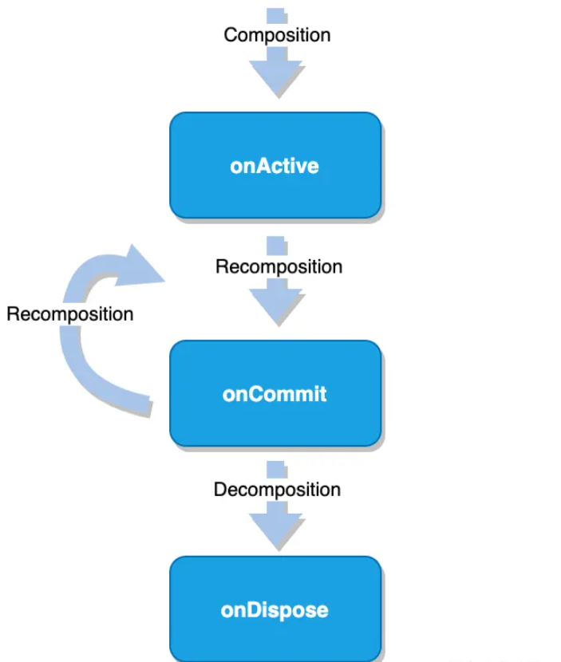

## 处理副作用

Composable是纯函数，即没有副作用的函数。纯函数是幂等的，唯一输入（参数）决定唯一输出（返回值），不会因为运行次数的增加导致返回值的不同。  
Composable是通过函数的反复执行来渲染UI的，函数执行的时机和次数都是不可控的，但是函数的执行结果必须可控，因此我们必须要求这些函数组件没有副作用。  
但实际情况是有一些逻辑只能作为副作用来处理，例如一些IO操作、业务逻辑影响等，这些都会对外界或者受到外界的影响，不能无限制的反复执行，所以需要合理处理这些副作用。

### Composable的生命周期



- onActive:当Composable首次进入组件树时
- onCommit：UI随着recomposition发生更新时
- onDispose：当Composable从组件树移除时

### DisposableEffect

DisposableEffect可以感知onCommit和onDipose的生命周期回调，在里面进行Effect处理。

```java
//DisposableEffect在onCommit的时候调用
DisposableEffect(key) {
            //仅当key改变时会调用，避免无效的执行。
            text.value = passwordText.value
            onDispose {
              //当组件onDispose会调用
            }
        }
```

### SideEffect

SideEffect可以用来更新外部的状态

```java

SideEffect{
        //每次commit都会执行
      }

```

### LaunchEffect

可以用来处理包含suspend调用的Effect。

```java

LaunchedEffect(key) {
    //当key改变时调用
    //提供协程作用域
  }

```

### produceState

produceState基于LaunchedEffect实现，进一步简化了state的初始化和更新逻辑。

```java

val uiState = produceState(initialValue = "test", key) {
          viewModel
              .loginTest()
              .collect {
                  value = it.toString()
              }
      }

```

## 状态管理

### LiveData and State

如果你想通过数据变化自动刷新UI显示，LiveData和State都只能在它所包裹的对象发生变化时刷新UI。
所以当我们包裹的是一个对象，只是更改了对象中某个属性的值时，这并不会触发重组，刷新UI。

对于这种情况可以针对对象的某个属性使用`MutableState<T>`包裹，例如：

``` kotlin

data class People(var name: MutableState<String>, var sex:String)

```

使用时还需注意，需要刷新的Widget还需显示的调用一次该属性，如：


```java

val tom by viewModel.student

 Box(modifier = Modifier.fillMaxSize()) {
     Column() {

         Text(text = tom.name.value)

         Button(onClick = {
             viewModel.changeSex()
         }) {
             Text(text = "change value")
         }
     }
 }

```
和

```java
   val tom by viewModel.student

    Box(modifier = Modifier.fillMaxSize()) {
        Column() {
            Text(text = tom.toString())
            ...
        }
    }

```

当改变name属性值时，只有前者会触发UI重组（Compose），这与compose的重组机制有关。

### 手动触发重组
currentRecomposeScope.invalidate()


## 数据类管理

对于后台返回的展示数据类，推荐自定义一个用于展示的数据类，这样做有几点好处：

 - 方便UI状态控制，使用 MutableState<T>包裹数据
 - 对数据进行预处理，让后续业务流程可以直接使用该数据
 - 方便维护，如果接口返回数据类型有变化，不会影响到业务模块

写法展示：

```java

class GoodsInfoResp(
    //根据typeGuid已经分好类
    val typeList: List<PadTypeRespDTO>?
) {

    fun toDisplayData() = this.typeList?.map {
        it.toDisplayData()
    }
}


data class PadTypeResp(
    val menuClassifyPictureType: Int? = 0,
    val name: String,
    val sort: Int,
    val typeGuid: String,
    val itemList: List<PadItemRespDTO> = mutableListOf(),
) {

    fun toDisplayData() = DisplayTypeData(
        menuClassifyPictureType = this.menuClassifyPictureType!!,
        name = mutableStateOf(this.name),
        ...
        padItemRespDTOList = this.itemList.map {
            it.toDisplayData(this.menuClassifyPictureType)
        }
    )

}

//获取数据时，在repository中将数据转换成能直接使用的数据类

suspend fun requestGoodsList(): Flow<List<DisplayTypeData>?> {
     return source.getGoodsList()
         .map { it.toDisplayData() }
         .map {...}
 }

```

## 事件传递

### 使用回调

在官方给的demo中，compose的事件都是通过回调层层下发的，像是这样：

```java
@Composable
fun RegisterScreen(
    modifier: Modifier,
    defaultPhone: String? = null,
    jump2Login:(String,String?) -> Unit,
    onHasRegistered:(String) -> Unit,
    onRegisterClick: (
        registerMemberReq: RegisterMemberReq,
        onRegisterSuc: () -> Unit,
        onRegistered: () -> Unit
    ) -> Unit
)

```

如果只有一层还好，如果要层层传递就很难受了，每个widget都要写。  

### 使用viewmodel

如果直接将viewmodel传入widget，的确会省不少事，这样也会出现新的问题。

 **widget不解耦，需要传入特定的viewmodel**

综上暂时没有完美的解决方案，只能权衡利弊使用这两种方式。


## Dialog

compose中dialog是通过状态来控制显隐的，这样写也会遇到几个问题：

 - 需要显示这个dialog的activity都要提前写好widget，并用状态去控制它
 - dialog不能单独处理业务，需要依附于viewmodel

这些问题导致它完全不能复用，所以对于需要复用的业务dialog，推荐还是使用DialogFragment。  


## ViewModel膨胀

如果使用了官方给的Compose Navigation会导致一个问题，页面其实还是使用的同一个Activity，只有一个ViewModel。  
如果业务不够复杂还好，如果界面多、业务复杂会导致ViewModel越来越膨胀，针对这种情况最好还是使用原生的fragment，每个fragment再创建自己的ViewModel。


## 换肤

如果使用官方给的api换肤会有个颜色数量限制，只能使用这些命名：

```java
class Colors(
    primary: Color,
    primaryVariant: Color,
    secondary: Color,
    secondaryVariant: Color,
    background: Color,
    surface: Color,
    error: Color,
    onPrimary: Color,
    onSecondary: Color,
    onBackground: Color,
    onSurface: Color,
    onError: Color,
    isLight: Boolean
)

```

所以我模仿官方的写法自定义了个colorSet。代码如下：

```java

class CustomColors(
    val primary: Color,
    val background: Color,
    val primaryVariant: Color,
    val secondary: Color,
    ...
)

val darkColorSet = CustomColors(
    primary = green6DDACB,
    background = Color.Black,
    primaryVariant = Color.Yellow,
    secondary = Color.Blue
)

val lightColorSet = CustomColors(
    primary = green6DDACB,
    background = Color.Cyan,
    primaryVariant = Color.Gray,
    secondary = Color.Blue
)

@Composable
fun ProvideColors(
    colorSet: CustomColors,
    content: @Composable () -> Unit
) {
    CompositionLocalProvider(LocalAppColors provides remember { colorSet }, content = content)
}

private val LocalAppColors = staticCompositionLocalOf {
    darkColorSet
}

object AppTheme {
    val colors: CustomColors
        @Composable
        get() = LocalAppColors.current

}

//最后在Theme外面包一层
//传入想要使用的主题
ProvideColors(colorSet = customSkin) {
    MaterialTheme(
        typography = Typography,
        shapes = Shapes,
        content = content
    )
}

//使用时调用
 AppTheme.colors.primary

```

## 屏幕适配

屏幕适配方面我们采用了宽高分别计算比例，再来进行缩放，理论上适配任何屏幕。

首先获取屏幕宽高dp，根据设计稿宽高计算比例。

```java

@Composable
fun initScreenConfigInfo() {
    val config = LocalConfiguration.current

    val widthDp = config.screenWidthDp.toFloat()
    val heightDp = config.screenHeightDp.toFloat()

    scale = config.densityDpi/160f

    if (heightFactor == 0f) heightFactor = heightDp / designHeightDp
    if (widthFactor == 0f) widthFactor = widthDp / designWidthDp

}


@Stable
inline val Int.wdp: Dp
    get() {
        val result = this.toFloat() * widthFactor
        return Dp(value = result)
    }


@Stable
inline val Int.hdp: Dp
    get() {
        val result = this.toFloat() * heightFactor
        return Dp(value = result)
    }


@Stable
inline val Int.spi:TextUnit
    get() {
        return this* heightFactor.sp
}


```

具体使用时需要根据宽高来选择wdp和hdp。
