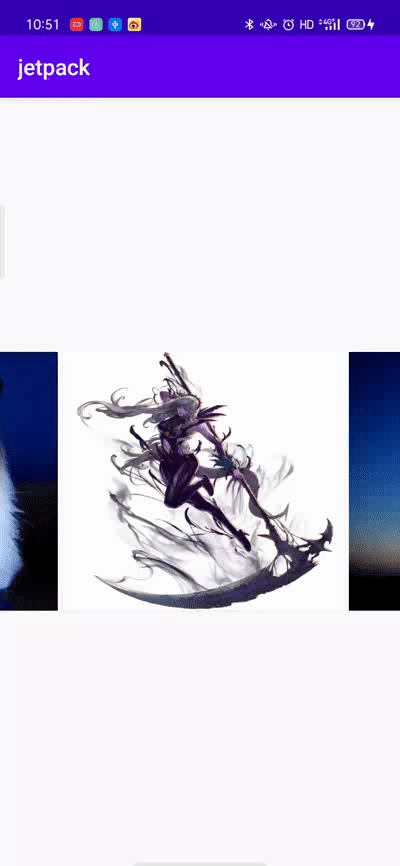
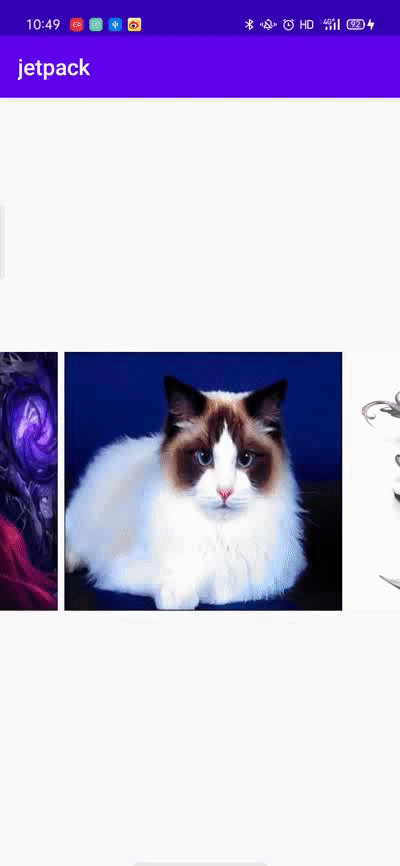
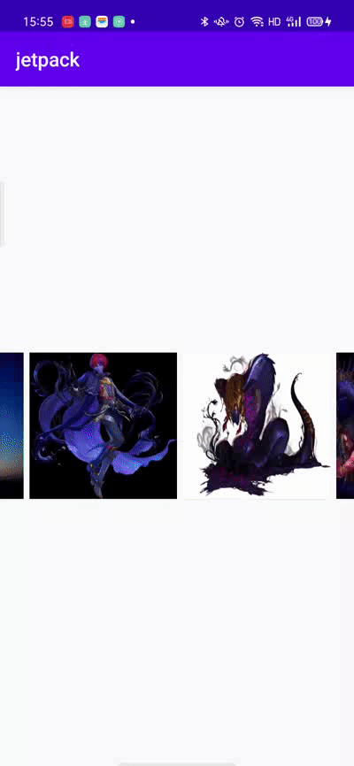

[IntentFlag启动模式](#1) 
<h3 id="1"></h3>

# SnapHelper

SnapHelper是一个RecyclerView的工具类，本身是抽象类，默认有两种实现LinearSnapHelper和PageSnapHelper。他们的主要作用是帮助ReyclerView自定义滑动方式，可以实现像ViewPage或者Gallery的滑动方式（一次翻一页或者一次翻多页）。

## PagerSnapHelper

**效果：一次只能滑动一个Item，总是中心对齐。**



**使用方法：**

```kotlin

        rv.let {
            it.layoutManager = LinearLayoutManager(this, LinearLayoutManager.HORIZONTAL, false)
            val recyclerViewAdapter = RecyclerViewAdapter()
            recyclerViewAdapter.loadData(imageList)
            it.adapter = recyclerViewAdapter
            PagerSnapHelper().attachToRecyclerView(it)
        }

```
用起来很简单，只需要加上`PagerSnapHelper().attachToRecyclerView(recyclerView)`即可。


## LinearSnapHelper

**效果：一次只可滑动多个Item（即支持Fling操作，惯性滑动），总是中心对齐。使用方法类似PagerSnapHelper，不再赘述。**



## SnapHelper源码解析

SnapHelper是一个抽象类，主要有三个抽象方法让子类实现，这里先介绍它们的作用，具体实现由子类完成。


- `  public abstract View findSnapView(RecyclerView.LayoutManager layoutManager);`

官方描述：**Override this method to provide a particular target view for snapping.**  

这个方法是找到一个**目标view**。这个**目标view**是什么要看子类的实现。比如LinearSnapHelper和PagerSnapHelper是中心对齐，所以它的目标view是RecyclerView布局中最靠近中间的view。


- ` public abstract int[] calculateDistanceToFinalSnap(LayoutManager layoutManager,View targetView);`  

官方描述：**Override this method to snap to a particular point within the target view or the container
view on any axis.**  

这个方法是计算出传入的targetView滑动到**对其位置**的距离。这个对齐位置也要看子类的实现，比如LinearSnapHelper和PagerSnapHelper是中心对齐，所以这个方法返回的是targetView到RecyclerView最中间位置的距离。


- `public abstract int findTargetSnapPosition(RecyclerView.LayoutManager layoutManager, int velocityX,
            int velocityY);
}`  

官方描述：**Override to provide a particular adapter target position for snapping.**  

这个方法是根据速度来找到target view的Position，这里的速度是监听FlingListener获得的。

介绍完抽象方法后我们来看SnapHelper的具体逻辑，首先从`attachToRecyclerView`这个方法切入。

```java

    public void attachToRecyclerView(@Nullable RecyclerView recyclerView)
            throws IllegalStateException {
        if (mRecyclerView == recyclerView) {
            return; // nothing to do
        }
        if (mRecyclerView != null) {
            destroyCallbacks();
        }
        mRecyclerView = recyclerView;
        if (mRecyclerView != null) {
            setupCallbacks();
            mGravityScroller = new Scroller(mRecyclerView.getContext(),
                    new DecelerateInterpolator());
            snapToTargetExistingView();
        }
    }

```
这里主要调用了 `setupCallbacks()`和`snapToTargetExistingView()`，`setupCallbacks()`主要是添加了`OnScrollListener`和`OnFlingListener`监听回调。`snapToTargetExistingView()`做了什么，下午会讲到。  

`OnScrollListener`的实现：

```java

private final RecyclerView.OnScrollListener mScrollListener =
            new RecyclerView.OnScrollListener() {
                boolean mScrolled = false;

                @Override
                public void onScrollStateChanged(RecyclerView recyclerView, int newState) {
                    super.onScrollStateChanged(recyclerView, newState);
                    if (newState == RecyclerView.SCROLL_STATE_IDLE && mScrolled) {
                        mScrolled = false;
                        snapToTargetExistingView();
                    }
                }

                @Override
                public void onScrolled(RecyclerView recyclerView, int dx, int dy) {
                    if (dx != 0 || dy != 0) {
                        mScrolled = true;
                    }
                }
            };

```

RecyclerView.OnScrollListener是RecyclerView的滚动监听,`onScrollStateChanged`是当滚动状态发生改变时调用,这里的 newState有三种状态：
  
 - public static final int SCROLL_STATE_IDLE = 0;//静止没有滚动
 - public static final int SCROLL_STATE_DRAGGING = 1;//正在被外部拖拽,一般为用户正在用手指滚动
 - public static final int SCROLL_STATE_SETTLING = 2;//自动滚动 

`onScrolled`则是滚动中的回调，dx，dy分别是横向和纵向的滚动距离。

这里的逻辑总结下来就是当滚动状态由滚动中变为静止时，调用  `snapToTargetExistingView();`

我们再来看看`snapToTargetExistingView()`做了什么。

```java
    void snapToTargetExistingView() {
        if (mRecyclerView == null) {
            return;
        }
        RecyclerView.LayoutManager layoutManager = mRecyclerView.getLayoutManager();
        if (layoutManager == null) {
            return;
        }
        View snapView = findSnapView(layoutManager);
        if (snapView == null) {
            return;
        }
        int[] snapDistance = calculateDistanceToFinalSnap(layoutManager, snapView);
        if (snapDistance[0] != 0 || snapDistance[1] != 0) {
            mRecyclerView.smoothScrollBy(snapDistance[0], snapDistance[1]);
        }
    }

```
这里先调用`findSnapView`找到targetView，在计算target view到对齐位置的距离，然后使用`  mRecyclerView.smoothScrollBy`将target view滑动到对齐位置。现在就好理解了，`attachToRecyclerView`里调用`snapToTargetExistingView()`是初始化当前RecyclerView里Item的对齐位置，滑动结束后再次调用是为了使滑动结束后的Item也保持对齐。

再来看看`OnFlingListener`里的逻辑：


```java
    @Override
    public boolean onFling(int velocityX, int velocityY) {
        RecyclerView.LayoutManager layoutManager = mRecyclerView.getLayoutManager();
        if (layoutManager == null) {
            return false;
        }
        RecyclerView.Adapter adapter = mRecyclerView.getAdapter();
        if (adapter == null) {
            return false;
        }
        int minFlingVelocity = mRecyclerView.getMinFlingVelocity();
        return (Math.abs(velocityY) > minFlingVelocity || Math.abs(velocityX) > minFlingVelocity)
                && snapFromFling(layoutManager, velocityX, velocityY);
    }

```

这里先判断速度是否达到最小Fling速度，达到了就调用` snapFromFling`。

```java
    private boolean snapFromFling(@NonNull RecyclerView.LayoutManager layoutManager, int velocityX,
            int velocityY) {
        if (!(layoutManager instanceof RecyclerView.SmoothScroller.ScrollVectorProvider)) {
            return false;
        }

        RecyclerView.SmoothScroller smoothScroller = createScroller(layoutManager);
        if (smoothScroller == null) {
            return false;
        }

        int targetPosition = findTargetSnapPosition(layoutManager, velocityX, velocityY);
        if (targetPosition == RecyclerView.NO_POSITION) {
            return false;
        }

        smoothScroller.setTargetPosition(targetPosition);
        layoutManager.startSmoothScroll(smoothScroller);
        return true;
    }
```
通过`findTargetSnapPosition`找到taget view的position,然后通过`smoothScroller`滚动到target view，当scroller滚动结束后，又会回调RecyclerView.OnScrollListener，这样又回到之前讲到的逻辑。滚动结束后调用`snapToTargetExistingView()`去对齐Item，这样Fling结束后也会保持Item的对齐。

### SnapHelper总结

SnapHelper主要是对RecyclerView的滑动添加了监听，OnScrollListener和OnFlingListener。每次滚动结束或者Fling（惯性滑动）结束后，对Item进行对齐，而其对齐方式让子类实现。

## LinearSnapHelper源码解析

LinearSnapHelper主要作用是让Item始终中心对齐，支持Fling。我们从之前讲到的三个抽象方法切入，来看看其具体实现。

### findSnapView

```java
    @Override
    public View findSnapView(RecyclerView.LayoutManager layoutManager) {
        if (layoutManager.canScrollVertically()) {
            return findCenterView(layoutManager, getVerticalHelper(layoutManager));
        } else if (layoutManager.canScrollHorizontally()) {
            return findCenterView(layoutManager, getHorizontalHelper(layoutManager));
        }
        return null;
    }

```

这里根据布局方向，调用了不同方向的 `OrientationHelper`，这个类是LayoutManagers的一个工具类，主要作用是来获取布局的一些信息，如子view的坐标，宽高、RecyclerView的宽高、起始坐标等。  

我们接着看`findCenterView`做了什么：


```java
    @Nullable
    private View findCenterView(RecyclerView.LayoutManager layoutManager,
            OrientationHelper helper) {
        //注意这里的childCount，并不是RecyclerView所有Item的个数，仅仅是当前屏幕上的Item个数。
        int childCount = layoutManager.getChildCount();
        if (childCount == 0) {
            return null;
        }

        View closestChild = null;
         //获取recyclerview的中间位置
        final int center = helper.getStartAfterPadding() + helper.getTotalSpace() / 2;
        int absClosest = Integer.MAX_VALUE;

        for (int i = 0; i < childCount; i++) {
            final View child = layoutManager.getChildAt(i);
            //计算child的中间位置
            int childCenter = helper.getDecoratedStart(child)
                    + (helper.getDecoratedMeasurement(child) / 2);
            //计算出child中线到recyclerview中线的距离。
            int absDistance = Math.abs(childCenter - center);

            /** if child center is closer than previous closest, set it as closest  **/
            if (absDistance < absClosest) {
                absClosest = absDistance;
                closestChild = child;
            }
        }
        return closestChild;
    }

```

结合上面的注释，可以看出`LinearSnapHelper`的`findSnapView`，是返回了当前RecyclerView据其中线最近的子View。

### calculateDistanceToFinalSnap


```java
    @Override
    public int[] calculateDistanceToFinalSnap(RecyclerView.LayoutManager layoutManager,View targetView) {
        int[] out = new int[2];
        if (layoutManager.canScrollHorizontally()) {
            out[0] = distanceToCenter(targetView,
                    getHorizontalHelper(layoutManager));
        } else {
            out[0] = 0;
        }

        if (layoutManager.canScrollVertically()) {
            out[1] = distanceToCenter(targetView,
                    getVerticalHelper(layoutManager));
        } else {
            out[1] = 0;
        }
        return out;
    }

```
这里依然是根据不同方向获取不同的OrientationHelper，在调用`distanceToCenter`。

```java
    private int distanceToCenter(@NonNull View targetView, OrientationHelper helper) {
    	 //得到target view中线的位置
        final int childCenter = helper.getDecoratedStart(targetView)
                + (helper.getDecoratedMeasurement(targetView) / 2);
        //得到recyclerview中线的位置
        final int containerCenter = helper.getStartAfterPadding() + helper.getTotalSpace() / 2;
        //两者相减，即是target view到中线的距离
        return childCenter - containerCenter;
    }

```

### findTargetSnapPosition


```java
@Override
    public int findTargetSnapPosition(RecyclerView.LayoutManager layoutManager, int velocityX,
            int velocityY) {
        //判断layoutmanager是否实现了RecyclerView.SmoothScroller.ScrollVectorProvider接口    
        if (!(layoutManager instanceof RecyclerView.SmoothScroller.ScrollVectorProvider)) {
            return RecyclerView.NO_POSITION;
        }
		 //这里的itemCount是RecyclerView所包含所有item的个数
        final int itemCount = layoutManager.getItemCount();
        if (itemCount == 0) {
            return RecyclerView.NO_POSITION;
        }
		  //当前最中间的view
        final View currentView = findSnapView(layoutManager);
        if (currentView == null) {
            return RecyclerView.NO_POSITION;
        }
		 
        final int currentPosition = layoutManager.getPosition(currentView);
        if (currentPosition == RecyclerView.NO_POSITION) {
            return RecyclerView.NO_POSITION;
        }

        RecyclerView.SmoothScroller.ScrollVectorProvider vectorProvider =
        (RecyclerView.SmoothScroller.ScrollVectorProvider) layoutManager;
		 //computeScrollVectorForPosition作用是获得一个方向矢量，返回值大于0，则是正向；小于0为负向。
        PointF vectorForEnd = vectorProvider.computeScrollVectorForPosition(itemCount - 1);
        if (vectorForEnd == null) {
            return RecyclerView.NO_POSITION;
        }

        int vDeltaJump, hDeltaJump;
        //判断布局方向
        if (layoutManager.canScrollHorizontally()) {
            //estimateNextPositionDiffForFling可以根据滚动速度计算出要滚动跨越的Item个数
            hDeltaJump = estimateNextPositionDiffForFling(layoutManager,
                    getHorizontalHelper(layoutManager), velocityX, 0);
            //判断滑动方向，负向则为负数。
            if (vectorForEnd.x < 0) {
                hDeltaJump = -hDeltaJump;
            }
        } else {
            hDeltaJump = 0;
        }
        //省略了纵向的代码
        ......

        int deltaJump = layoutManager.canScrollVertically() ? vDeltaJump : hDeltaJump;
        if (deltaJump == 0) {
            return RecyclerView.NO_POSITION;
        }
		  //当前position加上要滚动的position
        int targetPos = currentPosition + deltaJump;
        if (targetPos < 0) {
            targetPos = 0;
        }
        if (targetPos >= itemCount) {
            targetPos = itemCount - 1;
        }
        return targetPos;
    }

```

再来看下`estimateNextPositionDiffForFling`是怎么计算的。

```java

    private int estimateNextPositionDiffForFling(RecyclerView.LayoutManager layoutManager,
            OrientationHelper helper, int velocityX, int velocityY) {
        //调用calculateScrollDistance，计算出要滚动的总距离。
        int[] distances = calculateScrollDistance(velocityX, velocityY);
        //调用computeDistancePerChild，计算子Item的平均宽度
        float distancePerChild = computeDistancePerChild(layoutManager, helper);
        if (distancePerChild <= 0) {
            return 0;
        }
        
        int distance =
                Math.abs(distances[0]) > Math.abs(distances[1]) ? distances[0] : distances[1];
        //  要滚动的总距离/Item的平均宽度 = 要滚动跨越的Item个数
        return (int) Math.round(distance / distancePerChild);
    }

```
`calculateScrollDistance`具体实现：

```java
    public int[] calculateScrollDistance(int velocityX, int velocityY) {
        int[] outDist = new int[2];
        mGravityScroller.fling(0, 0, velocityX, velocityY,
                Integer.MIN_VALUE, Integer.MAX_VALUE, Integer.MIN_VALUE, Integer.MAX_VALUE);
        outDist[0] = mGravityScroller.getFinalX();
        outDist[1] = mGravityScroller.getFinalY();
        return outDist;
    }

```
可以看到是根据`Scroller.fling`来计算滚动总距离（学到一手，自定义滑动组件时可能会用到）。

`computeDistancePerChild`具体实现：

```java
    private float computeDistancePerChild(RecyclerView.LayoutManager layoutManager,
            OrientationHelper helper) {
        View minPosView = null;
        View maxPosView = null;
        int minPos = Integer.MAX_VALUE;
        int maxPos = Integer.MIN_VALUE;
        //当前屏幕中的Item个数
        int childCount = layoutManager.getChildCount();
        if (childCount == 0) {
            return INVALID_DISTANCE;
        }

        for (int i = 0; i < childCount; i++) {
            View child = layoutManager.getChildAt(i);
            final int pos = layoutManager.getPosition(child);
            if (pos == RecyclerView.NO_POSITION) {
                continue;
            }
            //minPosView屏幕中第一个子View
            if (pos < minPos) {
                minPos = pos;
                minPosView = child;
            }
            //minPosView屏幕中最后一个子View
            if (pos > maxPos) {
                maxPos = pos;
                maxPosView = child;
            }
        }
        if (minPosView == null || maxPosView == null) {
            return INVALID_DISTANCE;
        }
        //第一个子view的起始坐标x
        int start = Math.min(helper.getDecoratedStart(minPosView),
                helper.getDecoratedStart(maxPosView));
        //最后一个子view的结束坐标x
        int end = Math.max(helper.getDecoratedEnd(minPosView),
                helper.getDecoratedEnd(maxPosView));
        //两个view相距的距离
        int distance = end - start;
        if (distance == 0) {
            return INVALID_DISTANCE;
        }
        //获得view的平均宽度
        return 1f * distance / ((maxPos - minPos) + 1);
    }

```

总结一下，LinearSnapHelper的findTargetSnapPosition的代码看似很多，其实主要目的就是根据速度算出滚动目标view的position。

## 自定义SnapHelper

分析完了SnapHelper源码，根据业务需求，我们可以自定义SnapHelper，比如要做一个屏幕显示两页的Banner。



我们可以直接继承LinearSnapHelper，然后重写`calculateDistanceToFinalSnap`、`findSnapView`两个方法，去修改对齐方式。
此外还可以加上自动滚动的功能：

```kotlin
    private val slideRunnable: Runnable = object : Runnable {
        override fun run() {
            if (!recyclerView.layoutManager!!.isSmoothScrolling) {
                val targetPos = getCurrentItem()+1
                //这是自己重载的一个方法，滚动到目标target
                snapHelper?.snapToTargetExistingView(targetPos)

            }
            campaignBannerTimerHandler.postDelayed(this, 4000)
        }
    }
    
    fun startScroll() {
        campaignBannerTimerHandler.removeCallbacks(slideRunnable)
        campaignBannerTimerHandler.postDelayed(slideRunnable, 4000)
    }

    fun stopScroll() {
        campaignBannerTimerHandler.removeCallbacks(slideRunnable)
    }

```

因为SnapHelper一些属性、方法时private，修改不了的话，干脆直接借鉴(copy)整个文件，自己来魔改......


