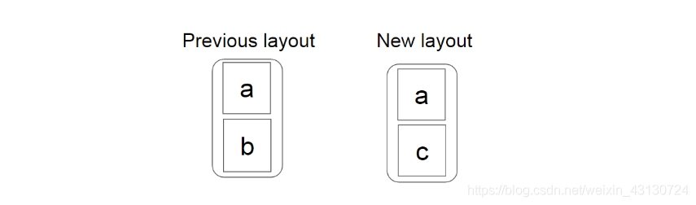
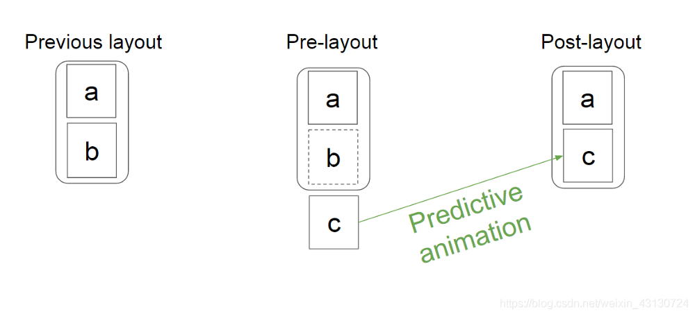
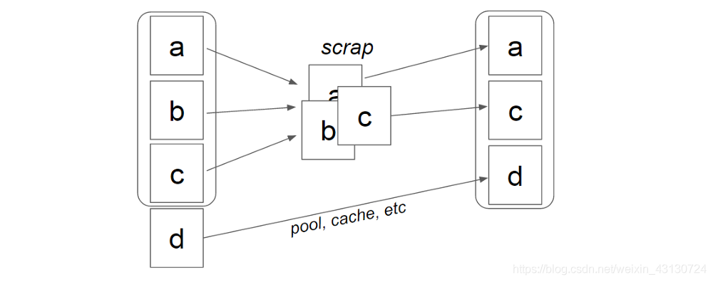
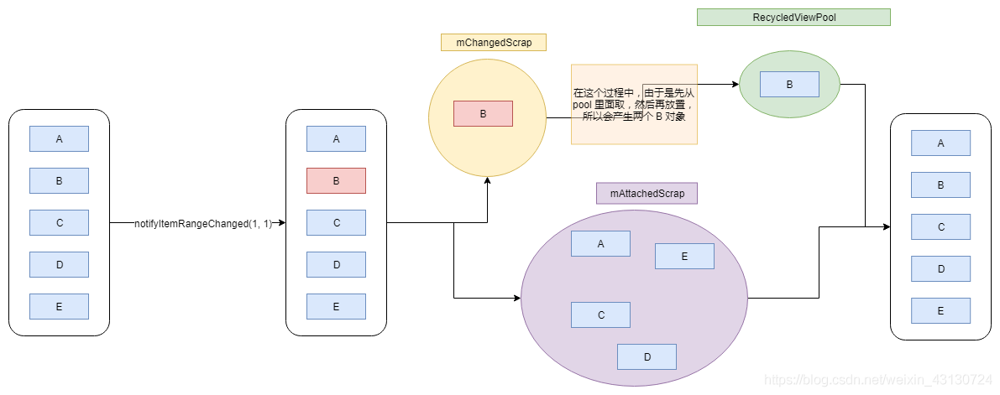

# RecyclerView缓存机制

RecyclerView之所以能滚动，就是因为它在监听到手指滑动之后，不断地更新Item的位置，也就是反复layout子View了，这部分工作由LayoutManager负责。

- mAttachedScrap：LayoutManager每次layout子View之前，那些已经添加到RecyclerView中的Item以及被删除的Item的临时存放地。使用场景就是RecyclerView滚动时、还有在可见范围内删除Item后用notifyItemRemoved方法通知更新时；

- mChangedScrap：作用：存放可见范围内有更新的Item。使用场景：可见范围内的Item有更新，并且使用notifyItemChanged方法通知更新时；

- mCachedViews：作用：存放滚动过程中没有被重新使用且状态无变化的那些旧Item。场景：滚动，prefetch；

- RecycledViewPool：作用：缓存Item的最终站，用于保存那些Removed、Changed、以及mCachedViews满了之后更旧的Item。场景：Item被移除、Item有更新、滚动过程；

## Scrap
Scrap 缓存列表（mChangedScrap、mAttachedScrap）是 RecyclerView 最先查找 ViewHolder 地方,其存在是为了预测动画效果。

mChangedScrap（只会在预布局阶段使用） 和 mAttachedScrap（pre-layout和post-layout） 只在布局阶段使用。其他时候它们是空的。布局完成之后，这两个缓存中的 viewHolder，会移到 mCacheView 或者 RecyclerViewPool 中。

举个例子：adapter.notifyItemRemoved(b)

在adapter发生更改后，RecyclerView会从LayoutManager请求两次布局。

第一个 —— pre-layout，因为我们可以收到适配器的变化，所以这里我们可以做一些特殊的处理。在我们的例子中，因为我们现在知道b被删除了，所以我们会额外的显示出c，尽管它已经超出界限。

第二个 ——post-layout，一个正常的布局，对应于更改后的适配器状态。

 

当LayoutManager开始布局的时候，当前布局中的所有view会被dump到scrap中（屏幕上变化的放入mChangedScrap 中，其余的放入mAttachedScrap 中），如果View没有发生变化，就一个个取出来填充。  
下图为预布局到最终布局的过程。

当我们调用 notifyItemRangeChanged 方法的时候，会触发 requestLayout 方法，就会重新布局，重新布局的话，就会先将 viewHolder 放到 scrap 中（屏幕上变化的放入mChangedScrap 中，其余的放入mAttachedScrap 中），然后 fill 布局的时候，再从 mAttachedScrap 里面取出来直接使用。mChangedScrap 中的 viewHolder 会被移动到 RecycledViewPool 中，所以 mChangedScrap 对应的 item 需要从 pool 中取对应的 viewHolder，然后重新绑定。  
下图为预布局过程：

### 为什么需要 mChangedScrap 与 mAttachedScrap 这两个缓存？
  
 因为 mChangedScrap 表示 item 变化了，有可能是数据变化，有可能是类型变化，所以它的 viewHolder 无法重用，只能去 RecycledViewPool 中重新取对应的，然后再重新绑定。 mAttachedScrap的viewHolder可以直接使用。
 
 
 
 
## mCachedViews

滑出屏幕的item将会存在mCachedViews。    
mCachedViews = ArrayList&lt;ViewHolder&gt; size = 2

只能用于指定位置，列表回滚时，刚滚出屏幕的表项再次进入屏幕时复用，复用时直接复用，不需要再次绑定数据。

## mViewCacheExtension

用户自定义缓存规则，默认没有实现。

## mRecyclerPool

mCacheViews超出size时，其老数据会被存入mRecyclerview。  
mRecyclerPool = SparseArray&lt; ViewType : ArrayList&lt;ViewHolder&gt;&gt; arrayList的最大值是5。  
按viewType存储ViewHolder，每种ViewHolder最多存五个。它复用时需要重新绑定数据，即调用adapter.onBindViewHolder（）。  
notifyDateSetChanged（）会首先将ViewHolder放入mChangedScrap，然后再放入RecyclerViewPool中，所以一页有很多item的时候，可以设置recyclerViewPool.set
  

