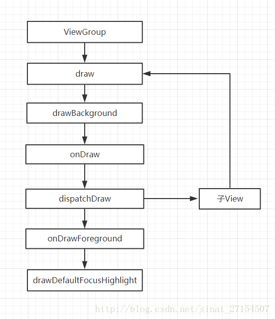

## ViewRootImpl

起点是ViewRootImpl的performTraversals()方法,里面调用了view的measure、layout、draw三个方法。

## measure

### MeasureSpec

父控件对子控件的绘制要求。   
前面2位代表的是mode，后面30位代表的是size。mode 主要分为3类，分别是：  

- EXACTLY：父容器已经测量出子View的大小。对应是 View 的LayoutParams的match_parent 或者精确数值。

- AT_MOST：父容器已经限制子view的大小，View 最终大小不可超过这个值。对应是 View 的LayoutParams的wrap_content

- UNSPECIFIED：父容器不对View有任何限制，要多大给多大，这种情况一般用于系统内部，表示一种测量的状态。

子View的MeasureSpec = 父View的MeasureSpec + 子View的LayoutParams

### onMeasure

子view的MeasureSpec获取方式:
final int childWidthMeasureSpec = getChildMeasureSpec(parentWidthMeasureSpec,mPaddingLeft + mPaddingRight, lp.width);        

ViewGroup的onMeasure：

- measureChildren(widthMeasureSpec, heightMeasureSpec);
- measureChild(child, widthMeasureSpec, heightMeasureSpec);
- child.measure(childWidthMeasureSpec, childHeightMeasureSpec);
- child.onMeasure(),根据measureSpec调用setMeasuredDimension 方法进行存储大小。
- 获取子view的宽高
- 根据子view宽高设置setMeasuredDimension

View的onMeasure：  
根据measureSpec调用setMeasuredDimension 方法进行存储大小。

## layout
自定义ViewGroup需要手动实现onLayout方法，默认是空实现。

ViewGroup的onLayout实现思路：

- 根据子view宽高，自身的margin，遍历调用子view的layout，确定子view的位置。

## draw

第一步：drawBackground(canvas)： 作用就是绘制 View 的背景。

第二步：onDraw(canvas) ：绘制 View 的内容。View 的内容是根据自己需求自己绘制的，所以方法是一个空方法，View的继承类自己复写实现绘制内容。

第三步：dispatchDraw（canvas）：遍历子View进行绘制内容。在 View 里面是一个空实现，ViewGroup 里面才会有实现。在自定义 ViewGroup 一般不用复写这个方法，因为它在里面的实现帮我们实现了子 View 的绘制过程，基本满足需求。

第四步：onDrawForeground(canvas)：对前景色跟滚动条进行绘制。

第五步：drawDefaultFocusHighlight(canvas)：绘制默认焦点高亮

