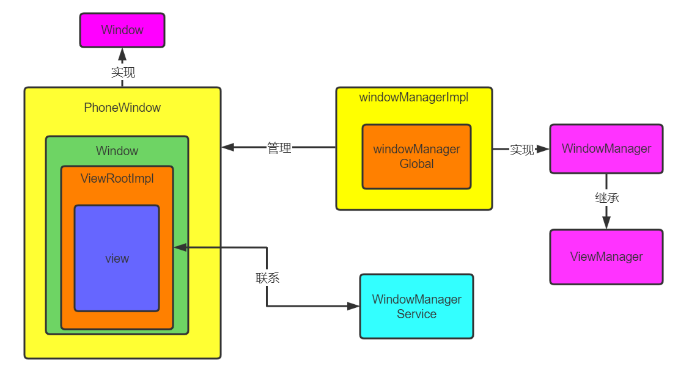
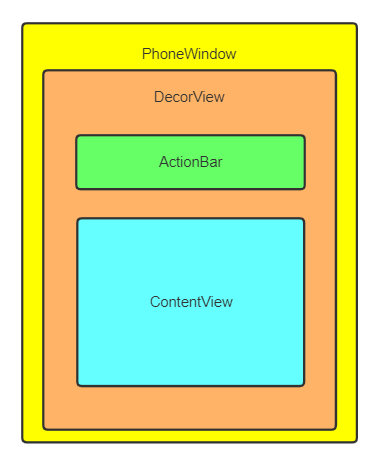
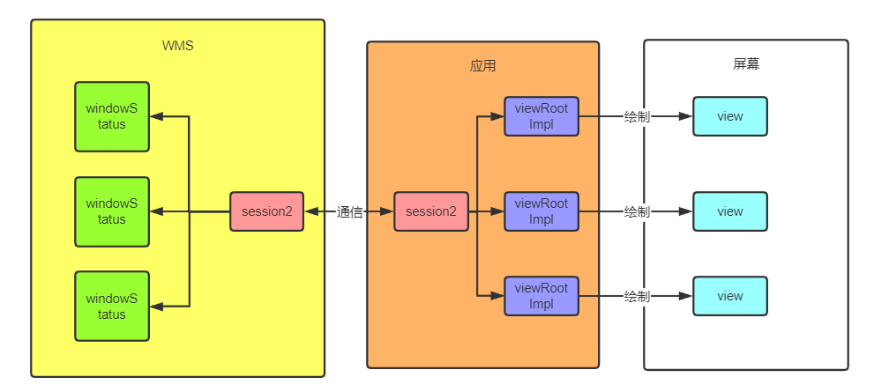
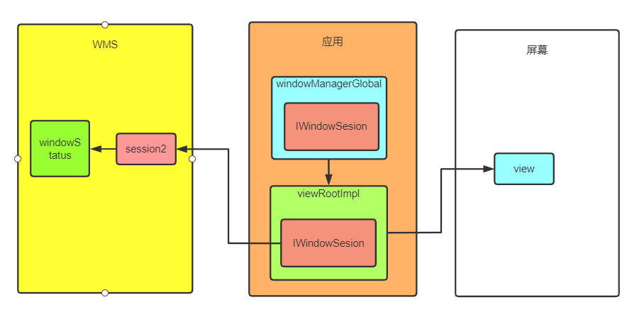
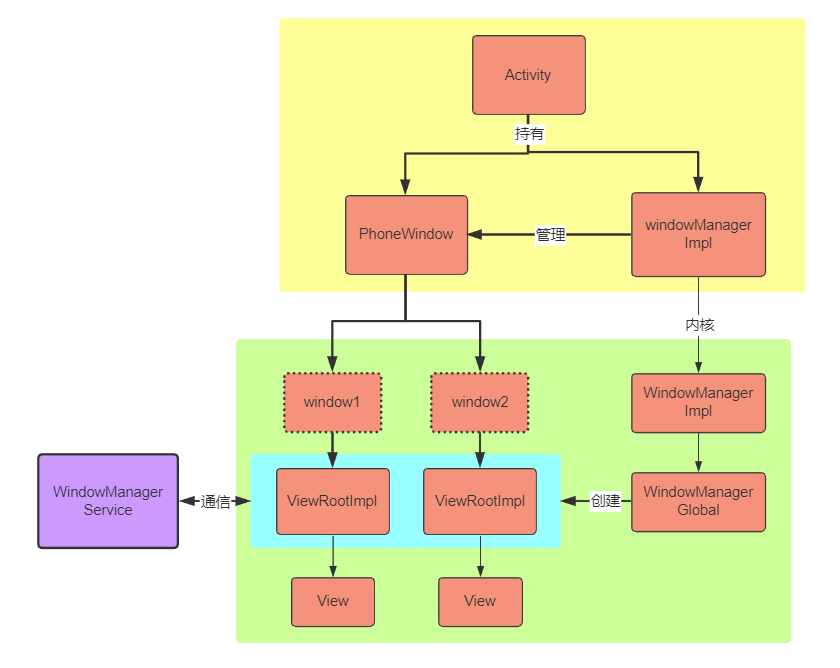

## window

每一个view树都可以看成是一个window，他是一个抽象的概念本身并不存在。View是Window存在的实体。

### window的添加

`WindowManage.addView()`

WindowManager的实现类WindowManagerImpl，它的addView方法是直接让WindowManagerGlobal去处理。  

WindowManagerGlobal是一个全局单例。它得addView做了以下操作：

- 新建viewRootImpl对象，并把view、viewRootImpl、params三个对象添加到三个list中进行保存

每一个window所对应的这三个对象都会保存在WindowManGlobal中，之后对window的一些操作就可以直接来这里取对象了。当window被删除的时候，这些对象也会被从list中移除。

- 通过ViewRootImpl去添加view

ViewRoorImpl主要是通过mWindowSession（Binder对象，也是个单例）调用WMS，WMS创建window，最后使用ViewRootImpl进行绘制。  

WMS在内部给每个应用session分配了一些数据结构如list，用于保存每个应用的window以及对应的viewRootImpl。当需要操作view的时候，通过session直接找到viewRootImpl就可以操作了。

### 总结

window的添加过程是通过PhoneWindow对应的WindowManagerImpl来添加window，内部会调用WindowManagerGlobal来实现。WindowManagerGlobal会使用viewRootImpl来进行跨进程通信让WMS执行创建window的业务。

每个应用都有一个windowSession，用于负责和WMS的通信，如ApplicationThread与AMS的通信。

图中绿色的window并不是一个类，而是真正意义上的window

## PhoneWindow  

PhoneWindow并不是view容器，而是window容器。那PhoneWindow的存在意义是什么？

- 提供DecorView模板

- 抽离Activity中关于window的逻辑。

- 限制组件添加window的权限。PhoneWindow内部有一个token属性，用于验证一个PhoneWindow是否允许添加window。在Activity创建PhoneWindow的时候，就会把从AMS传过来的token赋值给他，从而他也就有了添加token的权限。

### Activity创建PhoneWindow

在Activity创建过程中（具体在attach方法）会创建PhoneWindow、WindowManagerImpl，并将它两绑定在一起。Activity就可以通过WindowManager来操作PhoneWindow了。

调用Activity.setContentView：
  - PhoneWindow.setContentView：
  - 如果没有DecorView就创建一个
  - 将View添加打DecorView的mContentParent中
  - 回调Activity的onContentChanged方法
  - ActivityThread的handleResumeActivity首先会调用onResume()和makeVisible()
  (makeVisible中正是通过WindowManager去addView)

Dialog 的 Window 的创建过程与 Activity 类似。

## 总结

黄色部分属于谷歌提供给开发者的window框架，而绿色是真正的window机制结构。通过PhoneWindow我们可以很方便地进行window操作，而不须了解底层究竟是如何工作的。PhoneWindow的存在，更是让window的“可见性”得到了实现，让window变成了一个“view容器”。
