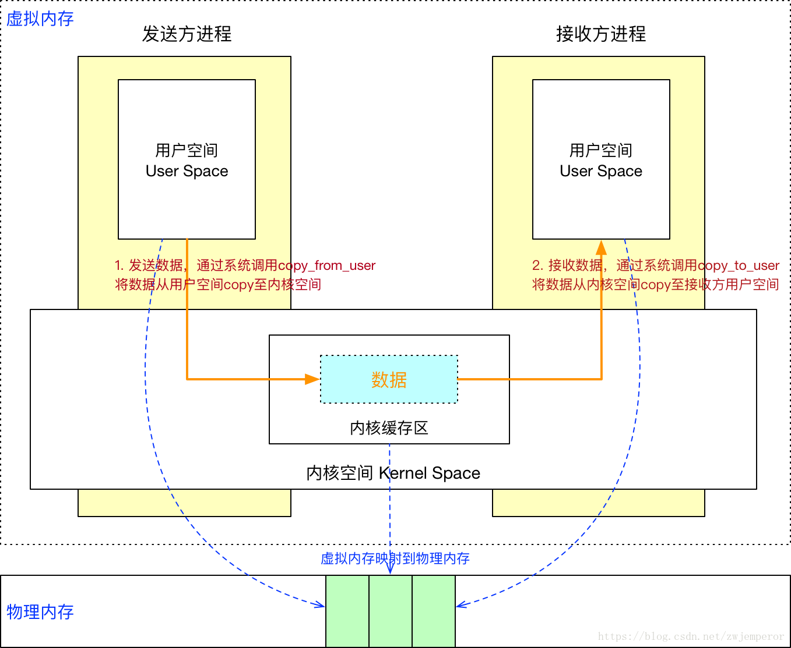
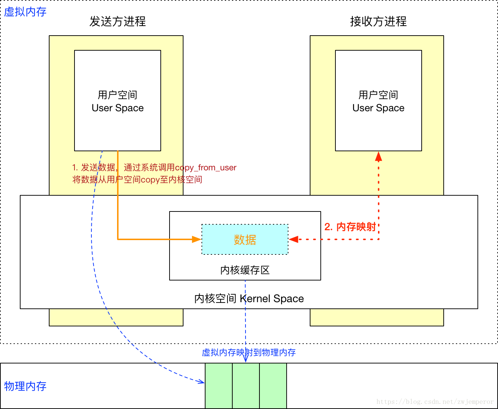
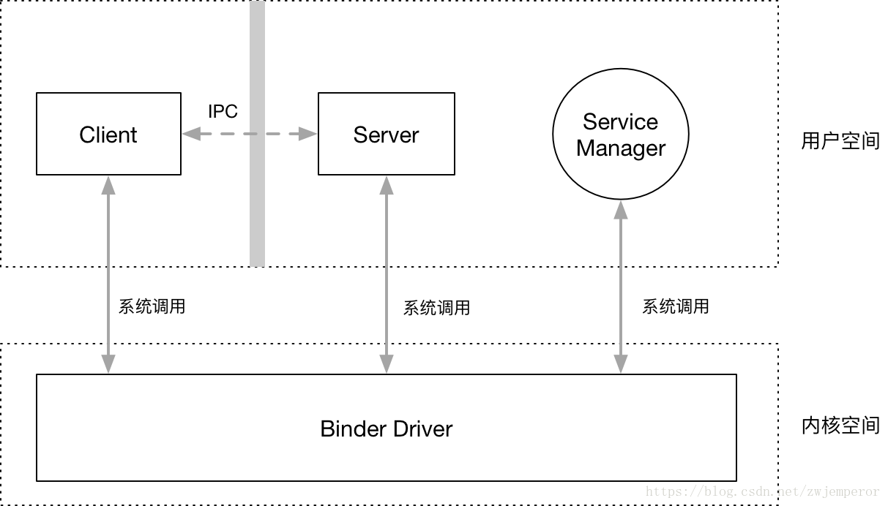
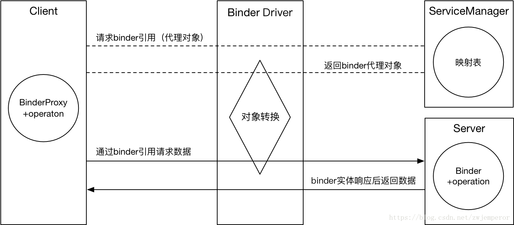

## 传统IPC缺陷

管道、消息队列、Socket实现一次进程通信都需要2次内存拷贝，效率太低。  
Binder只需要一次内存拷贝。

1.发送方进程通过系统调用（copy_from_user）将要发送的数据存拷贝到内核缓存区中。  
2.接收方开辟一段内存空间，内核通过系统调用（copy_to_user）将内核缓存区中的数据拷贝到接收方的内存缓存区。

## Binder基本原理

Linux是使用的是虚拟内存寻址方式，用户空间的虚拟内存地址是映射到物理内存中的，对虚拟内存的读写实际上是对物理内存的读写，这个过程就是内存映射，这个内存映射过程是通过系统调用mmap()来实现的。

Binder借助了内存映射的方法，在内核空间和接收方用户空间的数据缓存区之间做了一层内存映射。这样一来，从发送方用户空间拷贝到内核空间缓存区的数据，就相当于直接拷贝到了接收方用户空间的数据缓存区，从而减少了一次数据拷贝。

在Binder机制中，也定义了4个角色：Client、Server、Binder驱动和ServiceManager。

- Binder驱动：负责将Client的请求转发到具体的Server中执行，并将Server返回的数据传回给Client。  

- ServiceManager：负责将Client请求的Binder描述符转化为具体的Server地址，以便Binder驱动能够转发给具体的Server。Server如需提供Binder服务，需要向ServiceManager注册。

具体的通信过程是这样的：

 - 1.Server向ServiceManager注册

Server通过Binder驱动向ServiceManager注册，声明可以对外提供服务。ServiceManager中会保留一份映射表。

- 2.Client向ServiceManager请求Server的Binder引用

Client想要请求Server的数据时，需要先通过Binder驱动向ServiceManager请求Server的Binder引用。

- 3.向具体的Server发送请求

Client拿到这个Binder引用后，就可以通过Binder驱动和Server进行通信了。

- 4.Server返回结果

Server响应请求后，需要再次通过Binder驱动将结果返回给Client。

### ServiceManager通信原理

当Android系统启动后，会创建一个名称为servicemanager的进程，Binder驱动会自动为ServiceManager创建一个Binder实体。

并且这个Binder实体的引用在所有的Client中都为0，Server通过0号引用向ServiceManager进行注册，Client通过0号引用就可以获取到要通信的Server的Binder引用。

### Binder代理机制

实际上Client拿到的Binder引用并不是真正的实体，Binder驱动做了一层对象转换，将这个Object包装成了一个代理对象ProxyObject，这个ProxyObject和真正的Binder实体有相同的方法签名。
