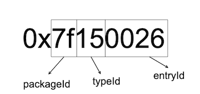

## 前言
这篇是之前发布过的[Android热修复原理](https://lexiangla.com/docs/146c2d2814e711ebbac8e66153f30ef1?company_from=1656b36e07d011e8b7a85254005b9a60)的后续（插件化需要使用到动态加载类的技术）。


## 插件化


插件化开发模式，打包时是一个宿主apk+多个插件apk。  
组件化开发模式，打包时是一个apk，里面分多个module。

优点:

- 安装的主apk包会小好多
- 给开发者提供了业务功能扩展，并且不需要用户进行更新
- 在非主apk包中的功能出现BUG时，可以及时修复
- 用户不需要的功能，完全就不会出现在系统里面，减轻设备的负担


需要掌握的知识：

 - 1.类加载机制
 - 2.四大组件启动流程
 - 3.AIDL、Binder机制
 - 4.Hook、反射、代理


### 1 Activity启动流程简单介绍


上图是普通的Activity启动流程，和根Activity启动流程的区别是不用创建应用程序进程（Application Thread）。

启动过程：  

- 应用程序进程中的Activity向AMS请求创建普通Activity
- AMS会对这个Activty的生命周期管和栈进行管理，校验Activity等等
- 如果Activity满足AMS的校验，AMS就会请求应用程序进程中的ActivityThread去创建并启动普通Activity

他们之间的跨进程通信是通过Binder实现的。


### 2 插件化原理
  通过之前介绍的热修复，我们有办法去加载插件apk里面的类，但是还没有办法去启动插件中的Activity，因为如果要启动一个Activity，那么这个Activity必须在AndroidManifest.xml中注册。

  这里介绍插件化的一种主流实现方式--Hook技术。

  - 1.宿主App预留占坑Activity
  - 2.使用classLoader加载dex文件到内存
  - 3.先使用占坑Activity绕过AMS验证，接着用插件Activity替换占坑的Activity。

  步骤1、2这里就不在赘述了，2就是上面讲到的热修复技术。


#### 2.1 绕开验证

AMS是在SystemServer进程中，我们无法直接进行修改，只能在应用程序进程中做文章。介绍一个类--IActivityManager，IActivityManager它通过AIDL（内部使用的是Binder机制）和SystemServer进程的AMS通讯。所以IActivityManager很适合作为一个hook点。

Activity启动时会调用IActivityManager.startActivity方法向AMS发出启动请求，该方法参数包含一个Intent对象，它是原本要启动的Activity的Intent。我们可以动态代理IActivityManager的startActivity方法，将该Intent换为占坑Activity的Intent，并将原来的Intent作为参数传递过去，以此达到欺骗AMS绕开验证。

```java
public class IActivityManagerProxy implements InvocationHandler {
    private Object mActivityManager;
    private static final String TAG = "IActivityManagerProxy";
    public IActivityManagerProxy(Object activityManager) {
        this.mActivityManager = activityManager;
    }
    @Override
    public Object invoke(Object o, Method method, Object[] args) throws Throwable {
        if ("startActivity".equals(method.getName())) {
            Intent intent = null;
            int index = 0;
            for (int i = 0; i < args.length; i++) {
                if (args[i] instanceof Intent) {
                    index = i;
                    break;
                }
            }
            intent = (Intent) args[index];
            Intent subIntent = new Intent();
            String packageName = "com.example.liuwangshu.pluginactivity";
            subIntent.setClassName(packageName,packageName+".StubActivity");
            subIntent.putExtra(HookHelper.TARGET_INTENT, intent);
            args[index] = subIntent;
        }
        return method.invoke(mActivityManager, args);
    }
}

```

接下来就通过反射的方式，将ActivityManager中的IActivityManager替换成我们的代理对象。

```java
  public void hookAMS() {
        try {
            Object defaultSingleton = null;
            if (Build.VERSION.SDK_INT >= 26) {
                Class<?> activityManagerClazz = Class.forName("android.app.ActivityManager");
                defaultSingleton = FieldUtil.getObjectField(activityManagerClazz, null, "IActivityManagerSingleton");
            } else {
                Class<?> activityManagerNativeClazz = Class.forName("android.app.ActivityManagerNative");
                defaultSingleton = FieldUtil.getObjectField(activityManagerNativeClazz, null, "gDefault");
            }
            Class<?> singletonClazz = Class.forName("android.util.Singleton");
            Field mInstanceField = FieldUtil.getField(singletonClazz, "mInstance");
            Object iActivityManager = mInstanceField.get(defaultSingleton);
            Class<?> iActivityManagerClazz = Class.forName("android.app.IActivityManager");
            Object proxy = Proxy.newProxyInstance(Thread.currentThread().getContextClassLoader(), new Class<?>[]{iActivityManagerClazz}, new IActivityManagerProxy(iActivityManager));
            mInstanceField.set(defaultSingleton, proxy);
        } catch (Exception e) {
            e.printStackTrace();
        }
    }

```
Note: 这里获取IActivityManager实例会因为Android版本不同而不同，具体获取方法就需要去看源码了解了。这里的代码Android 8.0是可以运行的。


#### 2.2 还原插件Activity
 ActivityThread启动Activity的过程如下所示：
 


ActivityThread会通过H在主线程中去启动Activity,H类是ActivityThread的内部类并继承自Handler。

```java
private class H extends Handler {
public static final int LAUNCH_ACTIVITY         = 100;
public static final int PAUSE_ACTIVITY          = 101;
...
   public void handleMessage(Message msg) {
            if (DEBUG_MESSAGES) Slog.v(TAG, ">>> handling: " + codeToString(msg.what));
            switch (msg.what) {
                case LAUNCH_ACTIVITY: {
                    Trace.traceBegin(Trace.TRACE_TAG_ACTIVITY_MANAGER, "activityStart");
                    final ActivityClientRecord r = (ActivityClientRecord) msg.obj;

                    r.packageInfo = getPackageInfoNoCheck(
                            r.activityInfo.applicationInfo, r.compatInfo);
                    handleLaunchActivity(r, null, "LAUNCH_ACTIVITY");
                    Trace.traceEnd(Trace.TRACE_TAG_ACTIVITY_MANAGER);
                } break;
                ...
              }
...
}

```

H中重写的handleMessage方法会对LAUNCH_ACTIVITY类型的消息进行处理，最终会调用Activity的onCreate方法。那么在哪进行替换呢？接着来看Handler的dispatchMessage方法：

```java
public void dispatchMessage(Message msg) {
       if (msg.callback != null) {
           handleCallback(msg);
       } else {
           if (mCallback != null) {
               if (mCallback.handleMessage(msg)) {
                   return;
               }
           }
           handleMessage(msg);
       }
   }

```

Handler的dispatchMessage用于处理消息，可以看到如果Handler的Callback类型的mCallback不为null，就会执行mCallback的handleMessage方法。因此，mCallback可以作为Hook点，我们可以用自定义的Callback来替换mCallback，自定义的Callback如下所示。

```java
public class HCallback implements Handler.Callback{
    public static final int LAUNCH_ACTIVITY = 100;
    Handler mHandler;
    public HCallback(Handler handler) {
        mHandler = handler;
    }
    @Override
    public boolean handleMessage(Message msg) {
        if (msg.what == LAUNCH_ACTIVITY) {
            Object r = msg.obj;
            try {
                //得到消息中的Intent(启动占坑Activity的Intent)
                Intent intent = (Intent) FieldUtil.getField(r.getClass(), r, "intent");
                //得到此前保存起来的Intent(启动插件Activity的Intent)
                Intent target = intent.getParcelableExtra(HookHelper.TARGET_INTENT);
                //将占坑Activity的Intent替换为插件Activity的Intent
                intent.setComponent(target.getComponent());
            } catch (Exception e) {
                e.printStackTrace();
            }
        }
        mHandler.handleMessage(msg);
        return true;
    }
}

```

最后一步就是用反射将我们自定义的callBack设置给`ActivityThread.sCurrentActivityThread.mH.mCallback`。

```java

    public void hookHandler() {
        try {
            Class<?> activityThreadClass = Class.forName("android.app.ActivityThread");
            Object currentActivityThread = FieldUtil.getObjectField(activityThreadClass, null, "sCurrentActivityThread");
            Field mHField = FieldUtil.getField(activityThreadClass, "mH");
            Handler mH = (Handler) mHField.get(currentActivityThread);
            FieldUtil.setObjectField(Handler.class, mH, "mCallback", new HCallback(mH));
        } catch (Exception e) {
             e.printStackTrace();
        }
    }

```

其实要想启动一个Activity到这步还没有完，一个完整的Activity应该还需要布局文件，而我们的宿主APP并不会包含插件的资源。

#### 2.3 加载插件资源

##### 2.3.1 Resources&AssetManager  
android中的资源大致分为两类：一类是res目录下存在的可编译的资源文件，比如anim，string之类的，第二类是assets目录下存放的原始资源文件。因为Apk编译的时候不会编译这些文件，所以不能通过id来访问，当然也不能通过绝对路径来访问。于是Android系统让我们通过Resources的getAssets方法来获取AssetManager，利用AssetManager来访问这些文件。  

其实Resource的getString, getText等各种方法都是通过调用AssetManager的私有方法来完成的。
过程就是Resource通过resource.arsc(AAPT工具打包过程中生成的文件)把ID转换成资源文件的名称，然后交由AssetManager来加载文件。

AssetManager里有个很重要的方法addAssetPath(String path)方法，App启动的时候会把当前apk的路径传进去，然后AssetManager就能访问这个路径下的所有资源也就是宿主apk的资源了。我们可以通过hook这个方法将插件的path传进去，得到的AssetManager就能同时访问宿主和插件的所有资源了。

```java
 public void hookAssets(Activity activity,String dexPath){
        try {
            AssetManager assetManager = activity.getResources().getAssets();
            Method addAssetPath = assetManager.getClass().getMethod("addAssetPath",String.class);
            addAssetPath.invoke(assetManager,dexPath);
            Resources mResources = new Resources(assetManager, activity.getResources().getDisplayMetrics(), activity.getResources().getConfiguration());
            //接下来我们要将宿主原有Resources替换成我们上面生成的Resources。
            FieldUtil.setObjectField(ContextWrapper.class,activity.getResources(),"mResources",mResources);
            
        } catch (NoSuchMethodException e) {
            e.printStackTrace();
        } catch (IllegalAccessException e) {
            e.printStackTrace();
        } catch (InvocationTargetException e) {
            e.printStackTrace();
        } catch (Exception e) {
            e.printStackTrace();
        }
    }

```

##### 2.3.2 id冲突
新的问题又出现了，宿主apk和插件apk是两个不同的apk，他们在编译时都会产生自己的resources.arsc。即他们是两个独立的编译过程。那么它们的resources.arsc中的资源id必定是有相同的情况。这样我们上面生成的新Resources中就出现了资源id重复的情况，这样在运行的时候使用资源id来获取资源就会报错。

怎么解决资源Id冲突的问题？这里介绍一下VirtualApk采用的方案。

**修改aapt的产物。即编译后期重新整理插件Apk的资源，编排ID，更新R文件**

VirtualApkhook了ProcessAndroidResourcestask。这个task是用来编译Android资源的。VirtualApk拿到这个task的输出结果，做了以下处理:

- 1.根据编译产生的R.txt文件收集插件中所有的资源
- 2.根据编译产生的R.txt文件收集宿主apk中的所有资源
- 3.过滤插件资源:过滤掉在宿主中已经存在的资源
- 4.重新设置插件资源的资源ID
- 5.删除掉插件资源目录下前面已经被过滤掉的资源
- 6.重新编排插件resources.arsc文件中插件资源ID为新设置的资源ID
- 7.重新产生R.java文件
 
大致原理是这样的，但如何保证新的Id不会重复了，这里介绍一下资源Id的组成。  


packageId: 前两位是packageId，相当于一个命名空间，主要用来区分不同的包空间(不是不同的module)。目前来看，在编译app的时候，至少会遇到两个包空间：android系统资源包和咱们自己的App资源包。大家可以观察R.java文件，可以看到部分是以0x01开头的，部分是以0x7f开头的。以0x01开头的就是系统已经内置的资源id，以0x7f开头的是咱们自己添加的app资源id。

typeId：typeId是指资源的类型id，我们知道android资源有animator、anim、color、drawable、layout，string等等，typeId就是拿来区分不同的资源类型。

entryId：entryId是指每一个资源在其所属的资源类型中所出现的次序。注意，不同类型的资源的Entry ID有可能是相同的，但是由于它们的类型不同，我们仍然可以通过其资源ID来区别开来。

所以为了避免冲突，插件的资源id通常会采用0x02 - 0x7e之间的数值。

