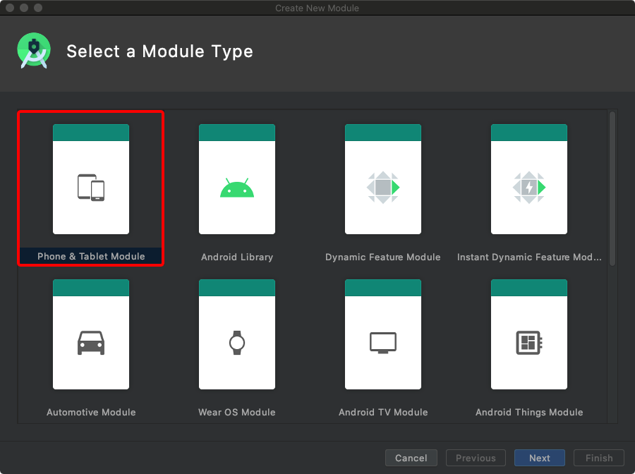

[热修复](#1)   
[插件化](#2) 


<h3 id="1"></h3>

## 热修复

### 什么是热修复？  
应用上线后出现小bug需要及时修复时，不用再发新的安装包，只需要发布补丁包，即可完成bug的修复。（不过没法上架Google play的，在国内很流行）

### 热修复原理
主流方案有两种，一种是微信Tinker的dex文件替换，另一种是阿里的Native层的方法替换。这里重点介绍Tinker的大致原理。

#### 类加载过程
介绍原理之前，先讲一讲Android类加载的过程。当我们new一个类时，首先是Android的虚拟机（Dalvik/ART虚拟机）通过ClassLoader去加载dex文件到内存。
Android中的ClassLoader主要是[PathClassLoader](https://cs.android.com/android/platform/superproject/+/master:libcore/dalvik/src/main/java/dalvik/system/PathClassLoader.java)和[DexClassLoader](https://cs.android.com/android/platform/superproject/+/master:libcore/dalvik/src/main/java/dalvik/system/DexClassLoader.java),这两者都继承自[BaseDexClassLoader](https://cs.android.com/android/platform/superproject/+/master:libcore/dalvik/src/main/java/dalvik/system/BaseDexClassLoader.java;l=38?q=BaseDexClass&sq=)。

PathClassLoader和DexClassLoader的区别：

- PathClassLoader只能指定加载apk包路径，不能指定dex文件解压路径。该路径是写死的在/data/dalvik-cache/路径下。所以只能用于加载已安装的apk。

- DexClassLoader可以指定apk包路径和dex文件解压路径（加载jar、apk、dex文件）

当ClassLoader加载类时，会调用它的findclass方法去查找该类。  
下方是BaseDexClassLoader的findClass方法实现：

```java
public class BaseDexClassLoader extends ClassLoader {
...
		
    @UnsupportedAppUsage
    private final DexPathList pathList;
    
    ...
    
     @Override
    protected Class<?> findClass(String name) throws ClassNotFoundException {
        // 首先检查该类是否存在shared libraries中.
        if (sharedLibraryLoaders != null) {
            for (ClassLoader loader : sharedLibraryLoaders) {
                try {
                    return loader.loadClass(name);
                } catch (ClassNotFoundException ignored) {
                }
            }
        }
        //再调用pathList.findClass去查找该类，结果为null则抛出错误。
        List<Throwable> suppressedExceptions = new ArrayList<Throwable>();
        Class c = pathList.findClass(name, suppressedExceptions);
        if (c == null) {
            ClassNotFoundException cnfe = new ClassNotFoundException(
                    "Didn't find class \"" + name + "\" on path: " + pathList);
            for (Throwable t : suppressedExceptions) {
                cnfe.addSuppressed(t);
            }
            throw cnfe;
        }
        return c;
    }
}

```

接下来我们再来看看DexPathList的findClass实现：

```java
 public DexPathList(ClassLoader definingContext, String librarySearchPath) {
...
    /**
     * List of dex/resource (class path) elements.
     * 存放dex文件的一个数组
     */
    @UnsupportedAppUsage
    private Element[] dexElements;
    
...
    
    public Class<?> findClass(String name, List<Throwable> suppressed) {
     	 //遍历Element数组，去查寻对应的类，找到后就立刻返回了
        for (Element element : dexElements) {
            Class<?> clazz = element.findClass(name, definingContext, suppressed);
            if (clazz != null) {
                return clazz;
            }
        }

        if (dexElementsSuppressedExceptions != null) {
            suppressed.addAll(Arrays.asList(dexElementsSuppressedExceptions));
        }
        return null;
    }
...
}
```

#### Tinker原理 

 - 1.使用DexClassLoader加载补丁包的dex文件
 - 2.通过反射获取DexClassLoader类的pathList，再次通过反射获得dexElements数组。
 - 3.获取加载应用类的PathClassLoader，同样通过反射获取它的dexElements数组。
 - 4.合并两个dexElements数组，且将补丁包的dex文件放在前面。  
 **根据类加载机制，一个类只会被加载一次，DexPathList.findClass方法中是顺序遍历数组，所以将补丁的dex文件放在前面，这样bug修复类会被优先加载，而原来的bug类不会被加载，达到了替换bug类的功能（补丁包中的修复类名、包名要和bug类相同）**
 - 5.再次通过反射将合并后的dexElements数组赋值给PathClassLoader.dexElements属性。  
  **加载类时，Dalvik/ART虚拟机会通过PathClassLoader去查找已安装的apk文件中的类。**

 Ok，这样就替换成功了，重启App，再调用原来的bug类，将会优先使用补丁包中的修复类。  
 **为什么要重启：一个类只会被ClassLoader加载一次，且加载过后的类不能卸载。**

### 代码实现
接下来我们动手撸一个乞丐版的Tinker。  
首先我们写一个bug类。

```java
package com.baima.plugin;

class BugClass {
    public String getTitle(){
        return "这是个Bug";
    }
}
```
接着我们新建一个module来生成补丁包apk。


创建bug修复类，注意包名类名要一样。

```java
package com.baima.plugin;

class BugClass {
    public String getTitle(){
        return "修复成功";
    }
}

```

生成补丁apk，将apk文件放到主项目的文件里去(一般情况都是推送补丁包apk，用户再下载下来)。接下来就是加载这个apk文件并替换了。

```java

    public void loadDexAndInject(Context appContext, String dexPath, String dexOptPath) {

        try {
            // 加载应用程序dex的Loader
            PathClassLoader pathLoader = (PathClassLoader) appContext.getClassLoader();
            //dexPath 补丁dex文件所在的路径
            //dexOptPath 补丁dex文件被写入后存放的路径
            DexClassLoader dexClassLoader = new DexClassLoader(dexPath, dexOptPath, null, pathLoader);
            //利用反射获取DexClassLoader和PathClassLoader的pathList属性
            Object dexPathList = getPathList(dexClassLoader);
            Object pathPathList = getPathList(pathLoader);
            //同样用反射获取DexClassLoader和PathClassLoader的dexElements属性
            Object leftDexElements = getDexElements(dexPathList);
            Object rightDexElements = getDexElements(pathPathList);
            //合并两个数组，且补丁包的dex文件在数组的前面
            Object dexElements = combineArray(leftDexElements, rightDexElements);
            //反射将合并后的数组赋值给PathClassLoader的pathList.dexElements
            Object pathList = getPathList(pathLoader);
            Class<?> pathClazz = pathList.getClass();
            Field declaredField = pathClazz.getDeclaredField("dexElements");
            declaredField.setAccessible(true);
            declaredField.set(pathList, dexElements);
        } catch (Exception e) {
            e.printStackTrace();
        }
    }
    
    private static Object getPathList(Object classLoader) throws ClassNotFoundException, NoSuchFieldException, IllegalAccessException {
        Class<?> cl = Class.forName("dalvik.system.BaseDexClassLoader");
        Field field = cl.getDeclaredField("pathList");
        field.setAccessible(true);
        return field.get(classLoader);
    }
    
    
    private static Object getDexElements(Object pathList) throws NoSuchFieldException, IllegalAccessException {
        Class<?> cl = pathList.getClass();
        Field field = cl.getDeclaredField("dexElements");
        field.setAccessible(true);
        return field.get(pathList);
    }
    
    private static Object combineArray(Object arrayLeft, Object arrayRight) {
        Class<?> clazz = arrayLeft.getClass().getComponentType();
        int i = Array.getLength(arrayLeft);
        int j = Array.getLength(arrayRight);
        int k = i + j;
        Object result = Array.newInstance(clazz, k);// 创建一个类型为clazz，长度为k的新数组
        System.arraycopy(arrayLeft, 0, result, 0, i);
        System.arraycopy(arrayRight, 0, result, i, j);
        return result;
    }

```

ok,乞丐版Tinker完成了，使用时先在Splash界面检查是否有插件补丁，有的话执行替换，这时你再使用bug类会发现它已经被替换成补丁中的修复类了。

<h3 id="2"></h3>

## 插件化

插件化开发模式，打包时是一个宿主apk+多个插件apk。  
组件化开发模式，打包时是一个apk，里面分多个module。

Activity插件化原理（一种方式）：

- 宿主App预留占坑Activity
- 使用classLoader加载dex文件到内存
- 先使用占坑Activity绕过AMS验证（使用hook给Intent添加插件Activity的信息），然后在主线程的handle处理startActivity时，通过hook的方式替换插件Activity。

