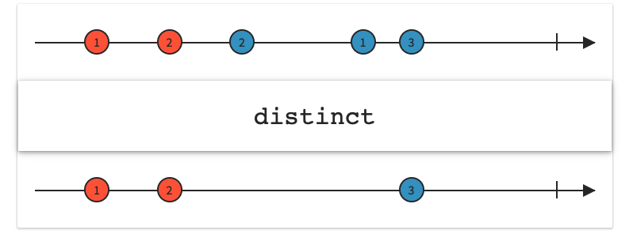
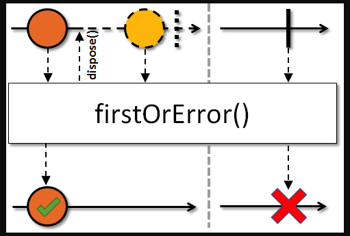
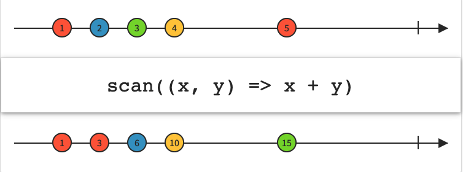
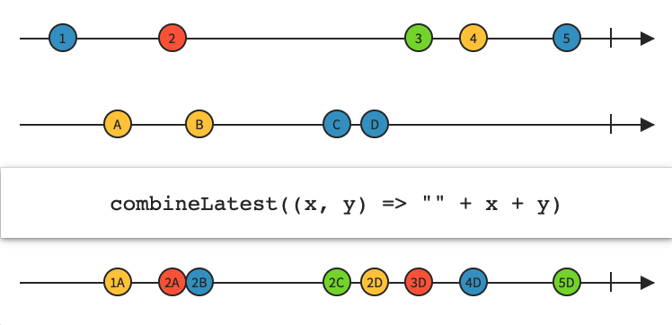

#RxJava

[distinctUntilChanged](#1)  
 [firstOrError](#2)   
 [just and fromCallable](#3)  
 [scan](#4)  
 [WithLatesFrom](#5)  
 [filter](#6)

<h3 id="1"></h3>

## distinctUntilChanged

   `public final Observable<T> distinctUntilChanged()`  
     去掉重复的，只保留一个。
   
   
   
 
   
   
<h3 id="2"></h3>

## firstOrError

`public final Single<T> firstOrError()`  
只发送第一个或者NoSuchElementException。

   
   
<h3 id="3"></h3>
## just and fromCallable

当just的参数为一个方法时，即使没有订阅也会先执行；fromCallable的参数是方法时，没有订阅便不会执行。

```kotlin

    val s1 = Single.just(just1())

    val s2 = Single.fromCallable { just2() }
    
    fun just1() {print("just1")}

    fun just2() {print("just2")}
	输出结果：
	just1
```

这样写just也不会执行。

```kotlin
 val s1 = Single.just{
        print("j1")
    }

```

<h3 id="4"></h3>
## scan

`  public final <R> Observable<R> scan(final R initialValue, BiFunction<R, ? super T, R> accumulator)` 
  
可以拿到上次流的数据。


<h3 id="5"></h3>
## WithLatesFrom


  
可以拿到两个流最近发射的数据。

<h3 id="6"></h3>
## filter
