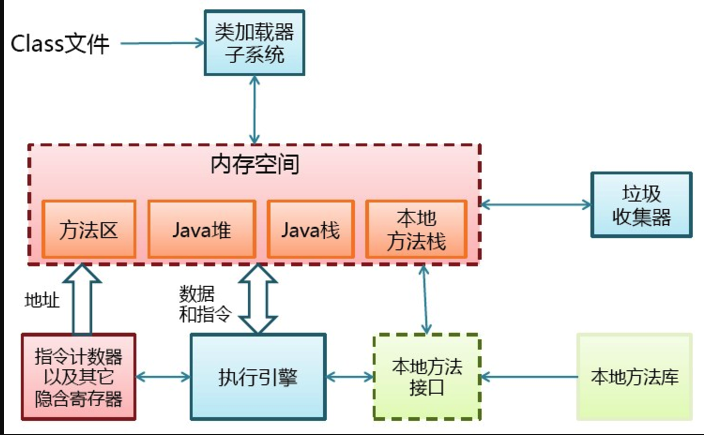
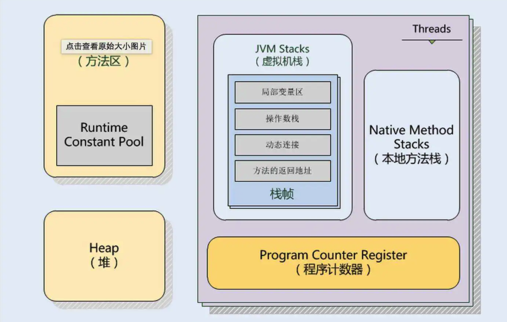

**目录**  

- [Java](#1)
	- [Java语言特性](#11)
	- [Java反射](#12)

- [Jvm](#2)
	- [Jvm 内存模型](#21)
	- [Jvm 垃圾回收](#22)
	- [类加载](#23)


<h3 id="11"></h3>

## Java语言特性

面向对象编程有三大特性：封装、继承、多态。

多态实现条件：  
 - 继承  
 - 重写  
 - 父类引用指向子类对象  

运行时多态依靠的是动态绑定。
### 动态绑定
方法被调用时会去查询引用对象的实际地址，找到被引用对象类中的方法表，如果表中包含该方法就直接调用，如果没找到就查询父类的方法。    

**方法表**：当虚拟机创建类时，会创建一个类的方法表，同时包含父类的方法列表。

### 静态绑定

在程序执行前，该方法就能够确定所在的类。  
当方法带有 static、final、private或者是构造方法时，就会默认使用静态绑定，即编译期间就能确定方法属于哪个类。


<h3 id="12"></h3>

## Java反射
Java的反射机制，操作的是.class文件，随后解剖（反射 reflect）出字节码中的构造函数、方法以及变量（字段）。  

private 本类、继承、接口中的方法 字段都可以得到。

`Class.forName() ` `Class.newInstance()` `Class.getConstructor()`

如果想在运行时改变，就需要反射这东西了。

<h3 id="21"></h3>

## Jvm内存模型




### 五大内存区域

#### 1.程序计数器
程序计数器是一块很小的内存空间，它是线程私有的，可以认作为当前线程的行号指示器。

#### 2.Java栈（虚拟机栈）
线程私有，描述的是Java方法执行的内存模型。

每个方法被执行的时候都会创建一个栈帧用于存储局部变量表，操作数栈，动态链接，方法出口等信息。每一个方法被调用的过程就对应一个栈帧在虚拟机栈中从入栈到出栈的过程。

- 局部变量表:一片连续的内存空间，用来存放方法参数，以及方法内定义的局部变量，存放着编译期间已知的数据类型(八大基本类型和对象引用(reference类型),returnAddress类型。

#### 3.本地方法栈
执行native方法。

#### 4.堆
堆是java虚拟机管理内存最大的一块内存区域，因为堆存放的对象是线程共享的，所以多线程的时候也需要同步机制。

所有对象实例及数组都要在堆上分配内存。

#### 5.方法区
线程共享的内存区域，用于存储已被虚拟机加载的类信息、常量、静态变量，如static修饰的变量加载类的时候就被加载到方法区中。

- 运行时常量池：方法区的一部分，存放编译期生成的各种**字面量**和符号引用，在运行期间也可以将新的变量放入常量池中，而不是一定要在编译时确定的常量才能放入。

<h3 id="22"></h3>

## Jvm垃圾回收

### 如何判断对象已死亡
当一个对象到GC Roots没有任何引用链相连时(从 GC Roots 到这个对象不可达)，证明此对象不可用。  

GC Roots包含以下几种：

- 虚拟机栈（栈帧中的局部变量表）中引用的对象
- 本地方法栈中引用的对象
- 方法区中静态属性引用的对象
- 方法区中常量引用的对象

### 标记清除

- 产生大量不连续内存碎片
- 标记和清除两个过程效率都不高

### 复制算法
此算法实现简单，运行高效，不会产生内存碎片。

新生代使用复制算法，新生代中98%的对象都是朝生夕死的，存活对象少。

将内存分为一块较大的（Eden）和两块较小的（From、To）区域，每次GC时将较大区域和其中一块小区域A的对象复制到另一块小区域B上，同时清理大区域和A的空间。  

如果一个对象在新生代AB区域复制交换多次（默认15次），如果最终还存活则存入老年代。

### 标记整理算法
复制收集算法在对象存活率较高时会进行比较多的复制操作，效率会变低，且没有额外空间对它进行分配担保。因此在老年代一般不能使用复制算法。

先标记不可达对象，然后将存活对象移动到内存一端，最后清除边界以外的内存。

<h3 id="23"></h3>

## 类加载

目的：**将类加载到方法区**

### 类加载过程

#### 1.加载
加载指的是将类的class文件读入到内存，并为之创建一个java.lang.Class对象，通过使用不同的类加载器，可以从不同来源加载类的二进制数据，通常有如下几种来源。

- 从本地文件系统加载class文件
- 从JAR包加载class文件
- 通过网络加载class文件
- 把一个Java源文件动态编译

类加载器通常无须等到“首次使用”该类时才加载该类，Java虚拟机规范允许系统预先加载某些类。

#### 2.链接
当类被加载之后，系统为之生成一个对应的Class对象，接着将会进入连接阶段，连接阶段负责把类的二进制数据合并到JRE中。类连接又可分为如下3个阶段。

- 验证：检验被加载的类是否有正确的内部结构，并和其他类协调一致。
- 准备：为类的静态变量分配内存，并设置默认初始值。
- 解析：将类的二进制数据中的符号引用替换成直接引用。

#### 3.初始化
初始化是为类的静态变量赋予正确的初始值

### 类加载时机

- 创建类的实例
- 访问某个类的静态属性（变量或是方法）
- 反射（Class.forName("com.lyj.load")）
- 初始化一个类的子类（会首先初始化子类的父类）
- JVM启动时标明的启动类，即文件名和类名相同的那个类    

### 类加载器

- 启动类加载器：它用来加载 Java 的核心类
- 扩展类加载器：它负责加载JRE的扩展目录
- 应用类加载器：被称为系统（也称为应用）类加载器，它负责在JVM启动时加载来自Java命令的-classpath选项、java.class.path系统属性，或者CLASSPATH换将变量所指定的JAR包和类路径。用户自定义的类加载器都以此类加载器作为父加载器。

### 类加载机制

双亲委派：类加载器在接到加载类的请求时，首先将加载任务委托给父加载器，依次递归，如果父加载器可以完成类加载任务，就成功返回；只有父加载器无法完成此加载任务时，才自己去加载。

通过这种层级关可以避免类的重复加载，java核心api中定义类型不会被随意替换。

### DexClassLoader

`public DexClassLoader (String dexPath, String dexOutputDir, String libPath, ClassLoader parent)`

DexClassLoader是一个可以从包含classes.dex实体的.jar或.apk文件中加载classes的类加载器。可以用于实现dex的动态加载、代码热更新等等。

### PathClassLoader

```java
public PathClassLoader (String path, ClassLoader parent)

public PathClassLoader (String path, String libPath, ClassLoader parent)

```

PathClassLoader提供一个简单的ClassLoader实现，可以操作在本地文件系统的文件列表或目录中的classes，但不可以从网络中加载classes。

DexClassLoader：能够加载未安装的jar/apk/dex   
PathClassLoader：只能加载已安裝到系統中（即/data/app目录下）的apk文件
