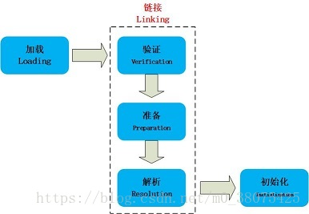
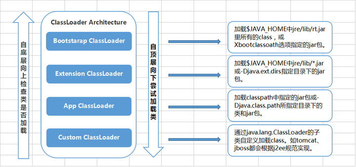

# 类加载

当程序主动使用某个类时，如果该类还未被加载到内存中，则JVM会通过加载、连接、初始化3个步骤来对该类进行初始化。

## 加载

- 1、通过一个类的全限定名来获取其定义的二进制字节流。

- 2、将这个字节流所代表的静态存储结构转化为方法区的运行时数据结构。

- 3、在Java堆中生成一个代表这个类的java.lang.Class对象，作为对方法区中这些数据的访问入口。

类的加载由类加载器完成，通过使用不同的类加载器，可以从不同来源加载类的二进制数据。

## 链接

### 验证
确保被加载的类的正确性。

### 准备
为类的静态变量分配内存，并将其初始化为默认值。

### 解析
把类中的符号引用转换为直接引用。

解析动作主要针对类或接口、字段、类方法、接口方法、方法类型、方法句柄和调用限定符7类符号引用进行。  
符号引用就是一组符号来描述目标，可以是任何字面量。  
直接引用就是直接指向目标的指针、相对偏移量或一个间接定位到目标的句柄。  

## 初始化

初始化是为类的静态变量赋予正确的初始值。

类什么时候才被初始化：

1）创建类的实例，也就是new一个对象

2）访问某个类或接口的静态变量，或者对该静态变量赋值

3）调用类的静态方法

4）反射（Class.forName("com.lyj.load")）

5）初始化一个类的子类（会首先初始化子类的父类）

6）JVM启动时标明的启动类，即文件名和类名相同的那个类 只有这6中情况才会导致类的类的初始化。

例外：对于一个final类型的静态变量，如果该变量的值在编译时就可以确定下来，那么这个变量相当于“宏变量”。Java编译器会在编译时直接把这个变量出现的地方替换成它的值，因此即使程序使用该静态变量，也不会导致该类的初始化。

## 类加载器

自定义类加载器 -> 应用类加载器 -> 扩展类加载器 -> 根类加载

双亲委派机制，其工作原理的是，如果一个类加载器收到了类加载请求，它并不会自己先去加载，而是把这个请求委托给父类的加载器去执行，依次递归，请求最终将到达顶层的启动类加载器，如果父类加载器可以完成类加载任务，就成功返回，倘若父类加载器无法完成此加载任务，子加载器才会尝试自己去加载。
